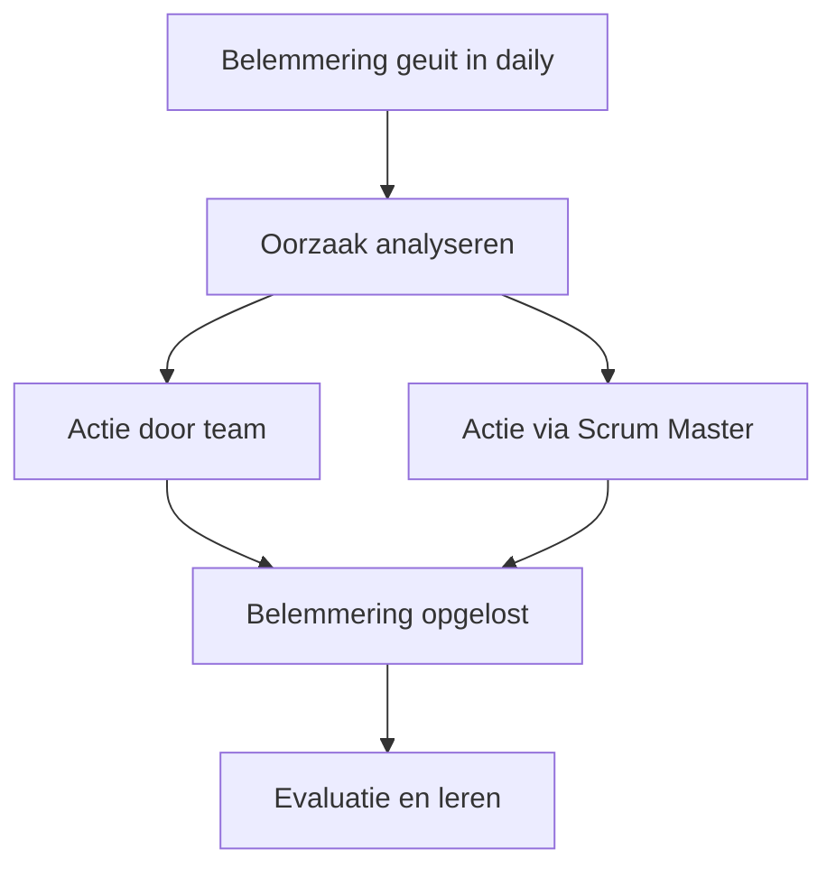

## Wat is het oplossen van belemmeringen?
Het **oplossen van belemmeringen** betekent dat obstakels die de voortgang van het werk vertragen of verhinderen, actief worden weggenomen. Waar het bij het uiten van belemmeringen gaat om het zichtbaar maken van het probleem, draait het bij het oplossen om het daadwerkelijk aanpakken ervan. Binnen SCRUM is dit een taak van het hele team, waarbij de Scrum Master een ondersteunende rol heeft.

> [!TIP] Casus  
> Tijdens een sprint blijkt dat een developer geen toegang heeft tot een externe API. Dit is in de daily stand-up als belemmering genoemd. De Scrum Master neemt contact op met de externe leverancier, regelt de benodigde rechten en zorgt ervoor dat het probleem binnen twee dagen is opgelost, zodat de developer verder kan.

## Hoe zit het oplossen van belemmeringen in elkaar?

Het oplossen van belemmeringen kan op verschillende niveaus plaatsvinden:
1. **Binnen het team:** Het team zoekt direct naar oplossingen die zij zelf in de hand hebben, bijvoorbeeld door werk te herverdelen of alternatieve aanpakken te onderzoeken.
2. **Met hulp van de Scrum Master:** Wanneer de belemmering buiten de invloed van het team ligt, faciliteert de Scrum Master door gesprekken aan te gaan met externe partijen, managers of leveranciers.
3. **Escaleren:** Als een belemmering structureel is of organisatorische barrières raakt, kan escalatie naar hoger management nodig zijn om blijvende oplossingen te realiseren.

### Voorbeeld in SCRUM
- In de **Daily Scrum** worden belemmeringen benoemd en meteen opgepakt.
- Tijdens de **Sprint** neemt het team of de Scrum Master acties om de belemmering op te lossen.
- In de **Retrospective** worden terugkerende belemmeringen besproken om structurele oplossingen te bedenken.
## Hoe gebruik je het oplossen van belemmeringen?
Het **oplossen van belemmeringen** wordt toegepast zodra er een obstakel bekend is. Belangrijk is om dit niet uit te stellen: een kleine vertraging kan anders uitgroeien tot een groter probleem.

Aanpak:
1. **Identificeer de belemmering** (via het uiten in de daily).
2. **Analyseer de oorzaak** (is het technisch, organisatorisch, extern?).
3. **Onderneem actie** (zelf oplossen, hulp Scrum Master, of escaleren).
4. **Evalueer** of de gekozen oplossing effectief was en herhaal dit indien nodig.

> [!TIP] Casus  
> Een tester kan geen geautomatiseerde tests draaien omdat de testserver traag reageert.
> 
> - Eisen:
>     
>     - Toegang tot een snelle en stabiele testomgeving.
>         
>     - Overleg met het infrastructuurteam.
>         
>     - Documenteren van tijdelijke workaround.
>         
> 
> Mogelijke uitwerking: de Scrum Master plant een overleg met het infrastructuurteam en vraagt om extra servercapaciteit. Het team spreekt af tijdelijk handmatig te testen totdat dit geregeld is.

**Mogelijke uitwerking van de casus**

---

> Volgende stap: [[5. Uitleg peerreviewen werk|Uitleg reviewen werk]]