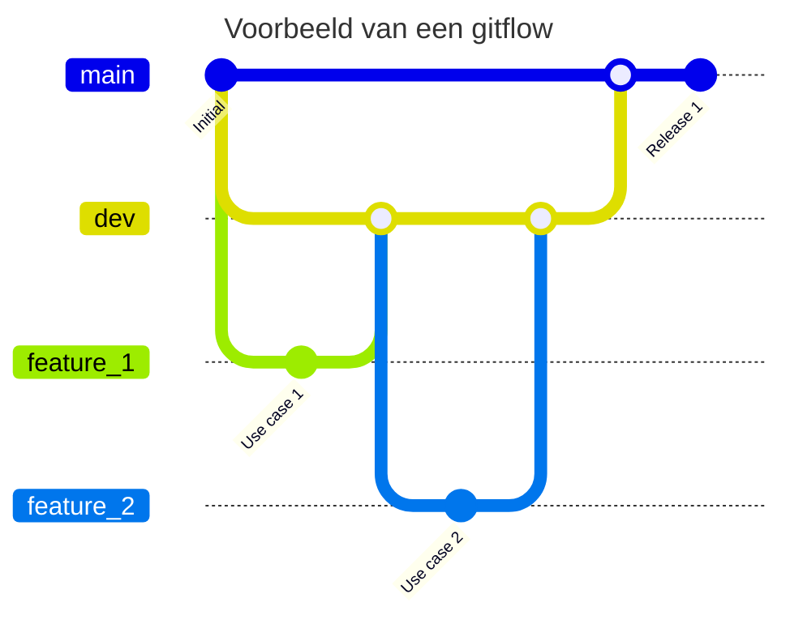

> Meer informatie over branches: [Git branches](https://git-scm.com/book/en/v2/Git-Branching-Branches-in-a-Nutshell)

## Wat is een branch?
Binnen een team waar een Git-repository wordt gebruikt voor een codeer project, zullen taken verdeeld worden. Om hierbij niet elkaar in de weg te lopen met veranderingen in bestanden, kan het handig zijn om een *branch* aan te maken. In een branch kan iedereen hun eigen aanpassingen maken, zonder dat de veranderingen invloed hebben op de code van je groepsgenoten. 

Een branch is een vertakking binnen een Git-repository. Bij het aanmaken van een repository komt altijd de branch `main`. Voorheen heette de standaard branch `master`, tegenwoordig is het `main`. In veel gevallen wordt de naam `master` ook vervangen voor `main`. Deze branch bevat vaak de meest stabiele versie van een project. Naast deze hoofdbranches kan je zelf ook branches erbij maken, zodat je kan werken aan de code zonder de code van de andere branches van de repository te beïnvloeden. 

In een repository voor een codeer project is het gebruikelijk om in ieder geval een `main` en een `dev`/`development` branch te hebben. Bij een project kan dan elke nieuwe feature een eigen branch krijgen als voorbeeld. Een `dev`-branch wordt vaak gebruikt voor een tussenstap tussen feature branches en release branches (worden later behandeld). Dit alles samen maakt een branching model genaamd Gitflow. 

*Diagram 1: Voorbeeld van een gitflow*

> Meer informatie over [Gitflow](https://www.atlassian.com/git/tutorials/comparing-workflows/gitflow-workflow)

### Lokale en remote branches
Branches kunnen lokaal of remote zijn. Lokale branches zijn, zoals de naam al zegt, op jouw machine aanwezig. Deze zijn (nog) niet zichtbaar voor andere.

[Remote branches](https://git-scm.com/book/en/v2/Git-Branching-Remote-Branches) werken net iets anders. In Git verwijst een remote branch naar een branch die bestaat op een externe repository in plaats van in jouw lokale repository. 

Een remote branch kan je identificeren aan het feit dat het in de meeste gevallen `origin/[BRANCH_NAAM]` zal heten. De standaard benaming voor de remote is `origin`. 

### Branch protection rules
Branches kunnen ook beschermd worden tegen bepaalde acties. In de workshop [[3. Procedurele informatie/4. Techniek/Workshop Git/3. Git Forks & Branches|3. Git Forks & Branches]] bij opdracht 3: Protection Rules wordt gewerkt met de `classic branch protection rule`. Hierbij komen de volgende opties beschikbaar:
![[OI_Git_Branches_1.png]]
*Figuur 1: Branch protection rules*

- `Require a pull request before merging`
	- Op deze branch kan alleen een verandering plaatsvinden via een pull request. Er kan niet op deze branch direct gecommit. (Pull requests worden behandeld in [[6. Git Pull requests]])
- `Require status checks to pass before merging`
	- Voordat een merge doorgevoerd kan worden moet iets eerst voldoen aan een set eisen. Hieronder een paar voorbeelden:
		- **Geautomatiseerde Tests**
			- Zorg ervoor dat alle eenheids-, integratie- en end-to-end tests succesvol worden uitgevoerd.
		- **Codekwaliteitschecks**
			- Statistische analysetools kunnen controleren op code stijl, potentiële bugs en andere kwaliteitsmetrics.
		- **Bouwsucces**
			- De code moet zonder fouten worden gecompileerd en gebouwd.
		- **Beveiligingsscans**
			- Geautomatiseerde tools kunnen controleren op bekende kwetsbaarheden in afhankelijkheden of code.
		- **Handmatige Reviews**
			- Sommige workflows vereisen dat een of meer teamleden de wijzigingen. beoordelen en goedkeuren.
- `Require conversation resolution before merging`
	- Bij een pull request moeten alle discussies zijn opgelost voordat de pull request doorgevoerd kan worden.
- `Require signed commits`
	- Door een commit te signen wordt geverifieerd dat de veranderingen die zijn gemaakt ook echt door de persoon zijn gemaakt.
- `Require linear history`
	- Er moet gewerkt worden met [lineaire history](https://www.atlassian.com/git/tutorials/merging-vs-rebasing) en niet met merging.
- `Require deployments to succeed before merging`
	- De pull request kan pas worden doorgevoerd als een deployment op een test- of stagingomgeving is gedeployed. Dit is vaak voor een `main` of `production` branch.
- `Lock branch`
	- Hiermee is een branch alleen te lezen en kunnen geen veranderingen worden gepusht naar de branch.
- `Do not allow bypassing the above settings`
	- Door deze optie aan te vinken, mogen ook admins en custom rollen met admin rechten niet meer *bypassen*. Als deze optie niet aangevinkt wordt, dan gelden bovenstaande regels niet voor admins en de custom rollen met admin rechten.

> Meer informatie over branch protection rules: [Branch protection rules](https://docs.github.com/en/repositories/configuring-branches-and-merges-in-your-repository/managing-protected-branches/managing-a-branch-protection-rule)

## Hoe zit een branch in elkaar?
Een branch verwijst altijd naar een versie van het project. Verschillende branches kunnen verwijzen naar verschillende versies van een project. Bijvoorbeeld, een feature branch kan wijzen naar een nieuwere versie door nieuwe wijzigen, terwijl de `main`-branch nog verwijst naar een oudere versie omdat de feature branch nog niet releasebaar is.

## Wat kan je met een branch?
Een branch kan gebruikt worden voor verschillende redenen:
- **Features:** Voor elke nieuwe functionaliteit kan een aparte branch worden aangemaakt. Dit wordt vaak een *feature branch* genoemd. Een feature branch isoleert de veranderingen op de branch van de bestanden op de `main`-branch. Met feature branches is het gebruikelijk om een 
	- Hierbij is een naamgeving zoals `feature/naam-van-de-feature` gebruikelijk.
- 
- **Bugs:** Als er bugs worden gevonden in een project is het gebruikelijk om hiervoor een *bug branch* aan te maken. 
	- Hierbij is een naamgeving zoals `fix/naam-van-de-bug` of `bug/naam-van-de-bug` gebruikelijk.
- **Releases:** Een *release branch* wordt vaak gebruikt om alle veranderingen samen te voegen en dit geheel te testen. Hierbij kunnen bugs of andere problemen naar boven komen die dan nog eerst opgelost moeten worden.
	- Hierbij is een naamgeving zoals `release/naam-van-de-release` gebruikelijk.
- **Experimenteren:** Soms kunnen er ideeën en concepten zijn waarmee eerst geëxperimenteerd wordt voordat het een feature wordt. Dit kan kunnen ook nieuwe technieken of architecturen zijn.
	- Hierbij is een naamgeving zoals `experiment/naam-van-het-experiment` gebruikelijk.

> [!tip] Casus
> Anne en Bert werken samen aan een project. Nadat Bert de repository van Anne gekloond heeft, begint hij met het maken van een nieuwe feature. Hiervoor maakt hij een nieuwe branch aan op basis van de laatste release versie op de `dev`-branch. Anne is al bezig met een feature op haar eigen branch. Anne en Bert kunnen hierdoor beide bezig gaan met verschillende features zonder dat Anne en Bert elkaar in de weg zitten.
> 
> Zodra zowel Anne en Bert klaar zijn met het maken van de nieuwe features, voegen zij hun code samen op een release branch en checken op deze branch nog een keer of alles werkt volgens de requirements. Alleen hierbij komt Bert erachter dat er nog een bug in het project zit. Hiervoor maakt hij een nieuwe bug branch aan en lost deze op. Nadat deze verandering weer is samengevoegd, voegen zij deze code samen met de `main`-branch voor een nieuwe release. 

> [!info] Bronnen
> Rebasing voor linear history: https://www.atlassian.com/git/tutorials/merging-vs-rebasing \
> Local vs. Remote branches : https://git-scm.com/book/en/v2/Git-Branching-Remote-Branches \
> Branches: https://git-scm.com/book/en/v2/Git-Branching-Branches-in-a-Nutshell \
> Branch protection rules: https://docs.github.com/en/repositories/configuring-branches-and-merges-in-your-repository/managing-protected-branches/managing-a-branch-protection-rule\
>  Gitflow : https://www.atlassian.com/git/tutorials/comparing-workflows/gitflow-workflow

---

> Volgende stap: [[4. Git Commits]]

