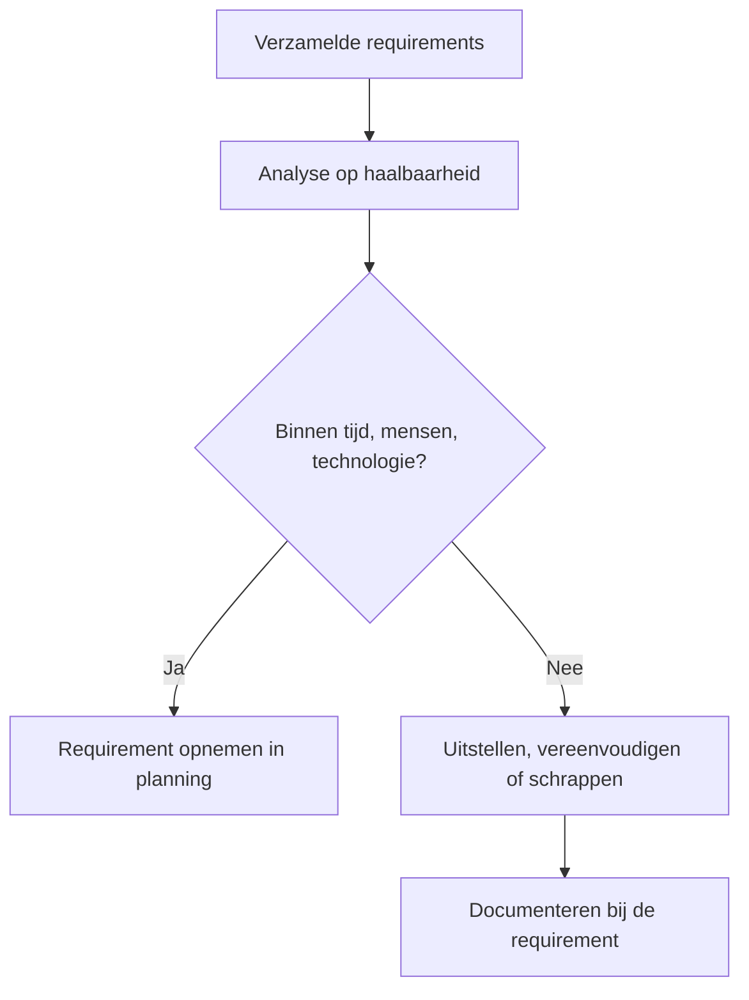

## Wat is bepalen haalbaarheid van requirements?
**Bepalen haalbaarheid van requirements** betekent dat je nagaat of de gestelde wensen en eisen uitvoerbaar zijn binnen de beschikbare middelen van het project. Denk hierbij aan mensen, tijd, technologie en beschikbare kennis. Niet alle requirements zijn direct realiseerbaar; sommige zijn te duur, technisch complex of passen niet binnen de planning. Deze analyse voorkomt dat je onrealistische verwachtingen wekt en helpt bij het maken van onderbouwde keuzes.

> [!TIP] Casus  
> In een project voor een leerplatform wil een klant een AI-module die automatisch studieadvies geeft. Tijdens de haalbaarheidsanalyse blijkt dat dit buiten de beschikbare expertise en sprintcapaciteit valt. Het team besluit om de AI-module op de backlog te zetten voor een latere fase. In plaats daarvan wordt een simpele scoretabel geïmplementeerd.

## Hoe zit bepalen haalbaarheid van requirements in elkaar?
Bij het bepalen van de **haalbaarheid van requirements** spelen drie aspecten een rol:

1. **Analyseren van beschikbare middelen:**  
   Je onderzoekt welke middelen (resources) het team beschikbaar heeft: hoeveel tijd, welke teamleden, welke kennis en technologie.

2. **Toetsen van technische haalbaarheid:**  
   Je onderzoekt of de techniek of technologie aanwezig is om de requirement te realiseren. Denk aan de beschikbaarheid van tools, frameworks, API’s of externe diensten.

3. **Documenteren van bevindingen:**  
   Je legt vast welke requirements wel of niet haalbaar zijn en waarom. Dit leg je vast bij de betreffende requirement in de requirementsanalyse. Hierdoor kan later worden teruggezocht op welke gronden een keuze is gemaakt.

> [!TIP] Casus  
> Een app moet live video kunnen streamen. Technisch is dat mogelijk, maar kost veel tijd. In overleg met de opdrachtgever besluit het team om in plaats daarvan een uploadmogelijkheid te implementeren in deze fase.
>
>**Mogelijke uitwerking van de casus**
>```markdown
>Requirement: Live videostream  
>Analyse: Technisch mogelijk, maar hoge ontwikkelkosten  
>Besluit: Niet haalbaar binnen sprint → vervangen door video-uploadfunctionaliteit  
>```

## Hoe gebruik je bepalen haalbaarheid van requirements?
Je voert deze analyse uit nadat de requirements zijn verzameld, maar voordat ze definitief worden gespecificeerd. Vaak werk je in overleg met stakeholders, de product owner of de architect (degene die de samenhang van alle applicaties in het oog houdt). Haalbaarheidsinformatie beïnvloedt prioriteit, planning en ontwerpbeslissingen. Je gebruikt daarbij hulpmiddelen zoals:

- **Proof of concept** voor technische haalbaarheid
- **Planning Poker** voor tijdsinschatting
- **MOSCOW-analyse** voor prioriteit
- **Risicoanalyse** om impact van onhaalbaarheid te begrijpen

> [!TIP] Casus  
> In een onderwijsproject wordt een dashboard ontworpen met complexe datavisualisaties. Het team onderzoekt of de gekozen visualisatietool geschikt is binnen de bestaande frontend stack. Na een test blijkt de tool moeilijk integreerbaar. De requirement wordt aangepast naar eenvoudiger tabellen en grafieken met bestaande bibliotheken.



### SCRUM
In SCRUM wordt tijdens de Backlog Refinement of Sprint Planning besproken of een requirement haalbaar is binnen de komende sprint.  
Het development team bepaalt gezamenlijk of iets ‘sprintbaar’ is op basis van kennis, beschikbare capaciteit en complexiteit.  
Niet-haalbare requirements worden gesplitst of verplaatst naar een latere sprint. De analyse van haalbaarheid is dus cyclisch en vindt plaats voor elke sprint, in nauwe samenwerking met de product owner.

### SSDLC
Binnen de SSDLC wordt tijdens de analyse- en ontwerpfasen gekeken of een requirement realiseerbaar en wat er gedaan moet worden aan veiligheid. Een requirement kan technisch haalbaar lijken, maar niet voldoen aan security-eisen (bijvoorbeeld opslag van persoonsgegevens zonder encryptie).  
Door tijdens deze fase de haalbaarheid te koppelen aan veiligheidsvereisten (zoals OWASP of ISO 27001), worden risico’s vroegtijdig onderkend.

> [!info] Bronnen  
> HBO-ICT-SE richtlijnen voor functioneel ontwerp (2025)  
> Handboek Requirements – N. de Swart (2022)  
> Succes met de Requirements – M. Arendsen e.a. (2012)

---

> Volgende stap: [[1. Uitleg vastleggen requirements|Uitleg vastleggen requirements]]