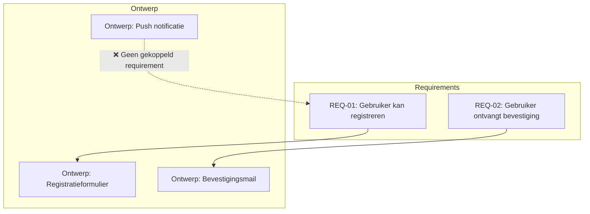
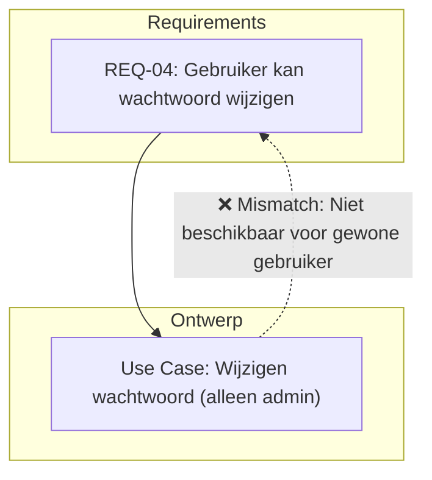

## Wat is controle op aansluiting op requirements?
**Controle op aansluiting op requirements** is het proces waarbij wordt nagegaan of het ontwerp, en uiteindelijk de implementatie, daadwerkelijk voldoet aan de gestelde eisen (requirements). Het doel is om fouten vroegtijdig te detecteren, om te voorkomen dat er gebouwd wordt aan functionaliteit die niet nodig of foutief is.

Deze controle wordt meestal uitgevoerd door het ontwerp te toetsen aan de originele requirements en deze traceerbaar te maken in het ontwerp zelf. Dit kan op verschillende manieren, bijvoorbeeld door een traceability matrix, annotaties of koppelingen in tools zoals Jira of Azure DevOps.

> [!TIP] Casus
> Een team ontwikkelt een app voor het plannen van afspraken. De opdrachtgever heeft als requirement opgegeven dat gebruikers meerdere afspraken op één dag moeten kunnen plannen. In het eerste ontwerp is echter slechts één afspraak per dag opgenomen. Door tijdens de ontwerpfase actief te controleren of elk requirement is verwerkt, valt dit op tijd op en kan het ontwerp worden aangepast.

## Hoe zit controle op aansluiting op requirements in elkaar?
De controle op aansluiting bestaat uit drie hoofdaspecten:

### 1. Traceerbaarheid (traceability)  
Elk element in het ontwerp moet herleidbaar zijn naar één of meerdere eisen. Dit zorgt ervoor dat niets vergeten wordt, en dat elke functie of component een reden van bestaan heeft.

#### Voorbeeld wanneer het misgaat:  
Tijdens een review van het ontwerp blijkt dat er een nieuwe notificatiefunctie is toegevoegd aan de app, maar deze is nergens terug te vinden in de oorspronkelijke requirements. Hierdoor ontstaat discussie of deze functie wel nodig is. Dit leidt tot onnodig werk en afstemming, en had voorkomen kunnen worden met een goede traceability check.

#### Correct voorbeeld:  
Elke feature in het ontwerp is expliciet gekoppeld aan een requirement ID. Er is bijvoorbeeld een traceability matrix of een koppeling vanuit een model naar de requirement database.

#### Mermaid-diagram


---

### 2. Validatie 
Validatie draait om de vraag: **Hebben we de juiste dingen ontworpen?** Het gaat hier vooral om het toetsen van het ontwerp tegen de bedoelingen van de gebruikers en stakeholders.

#### Voorbeeld wanneer het misgaat:  
Een product owner eist een exportfunctie naar Excel. Het ontwerpteam levert een printbare PDF, wat volgens hen "ook een export" is. Bij de sprint review blijkt dit niet te voldoen aan de wens van de gebruikers, waardoor het ontwerp aangepast moet worden en er tijd verloren gaat.

#### Correct voorbeeld:  
In plaats van aannames te doen over de betekenis van "export", heeft het team bij refinement gevraagd naar het gewenste formaat en dit vastgelegd in de acceptatiecriteria.

#### Tabel
| Requirement           | Interpretatie Ontwerp      | Opmerking         |
|-----------------------|-----------------------------|-------------------|
| Export voortgang      | PDF-export knop             | ❌ Niet akkoord   |
| Export voortgang      | Excel-export via .xlsx      | ✅ OK             |

---

### 3. Verificatie 
Verificatie is de technische controle: **Is wat we hebben ontworpen juist volgens de eisen?** Hierbij wordt gecontroleerd of de specificaties correct en volledig zijn geïmplementeerd.

#### Voorbeeld wanneer het misgaat:  
In het requirementsdocument staat dat gebruikers hun wachtwoord moeten kunnen wijzigen. In het ontwerp is deze functionaliteit alleen voorzien voor beheerders. Pas tijdens testen komt aan het licht dat gewone gebruikers deze optie missen – een verificatiefout in het ontwerp.

#### Correct voorbeeld:  
De use cases in het ontwerp zijn gekoppeld aan specifieke gebruikersrollen, en elk scenario is afgetoetst tegen de oorspronkelijke requirements.

#### Mermaid-diagram (Use case mismatch)


---

## Hoe gebruik je controle op aansluiting in je ontwerp?
Controle toepassen betekent dat je tijdens het ontwerpen:
- Per requirement vastlegt **waar en hoe** deze is opgenomen.
- Een overzicht bijhoudt waarin duidelijk is welke eisen al zijn verwerkt.
- Feedbacksessies organiseert met stakeholders om dit te toetsen.

> [!TIP] Casus  
> Voor een leerplatform zijn de volgende eisen gedefinieerd:  
> - Studenten moeten hun voortgang kunnen zien.  
> - Docenten willen de voortgang van alle studenten kunnen bekijken.  
>  
> In het ontwerp is een analytics-dashboard opgenomen. Bij elke component in het ontwerp is aangegeven welke requirement wordt gedekt.
>
> **Mogelijke uitwerking van de casus**
> ```
> // Component "StudentDashboard": toont persoonlijke voortgang
> // Requirement ID: FR-03
> 
> // Component "TeacherAnalytics": toont overzicht van klas
> // Requirement ID: FR-04
> ```
> 
> ```mermaid
> flowchart TD
>   R1[FR-03: Persoonlijke voortgang] --> C1[StudentDashboard]
>   R2[FR-04: Overzicht klas] --> C2[TeacherAnalytics]
> ```

### SCRUM
In het SCRUM-proces vindt controle op aansluiting op requirements vooral plaats **tijdens de refinement**, **de Sprint Planning** en **de sprint review**. Tijdens refinement worden requirements (bijvoorbeeld user stories) verduidelijkt en voorzien van acceptatiecriteria. Het ontwikkelteam vertaalt deze naar functionele componenten.  
Tijdens Sprint Planning wordt gecontroleerd of elk onderdeel van het geplande werk goed aansluit op de gestelde eisen. Aan het einde van de sprint, in de **sprint review**, kan met behulp van het ontwerp of de implementatie worden gevalideerd of aan alle eisen uit de sprint backlog is voldaan. Deze controle sluit nauw aan bij het inspectieprincipe van SCRUM.

### SSDLC
Binnen de Secure Software Development Life Cycle (SSDLC) speelt de controle op aansluiting op requirements een belangrijke rol in de **ontwerp- en validatiefase**. Tijdens het ontwerp wordt systematisch vastgelegd hoe elke requirement wordt gerealiseerd, inclusief beveiligingseisen (bijvoorbeeld encryptie of toegangscontrole).  
De SSDLC benadrukt **traceerbaarheid** en **documentatie**, en eist dat ontwerpbeslissingen gekoppeld zijn aan concrete requirements. In de validatiefase wordt vervolgens gecontroleerd of het ontwerp en de implementatie volledig voldoen aan de initiële eisen, wat cruciaal is voor auditability en compliance in beveiligingskritische software.

---

> Volgende stap: [[6. Uitleg controle toepassing ontwerptechnieken|Uitleg controle toepassing ontwerptechnieken]]
