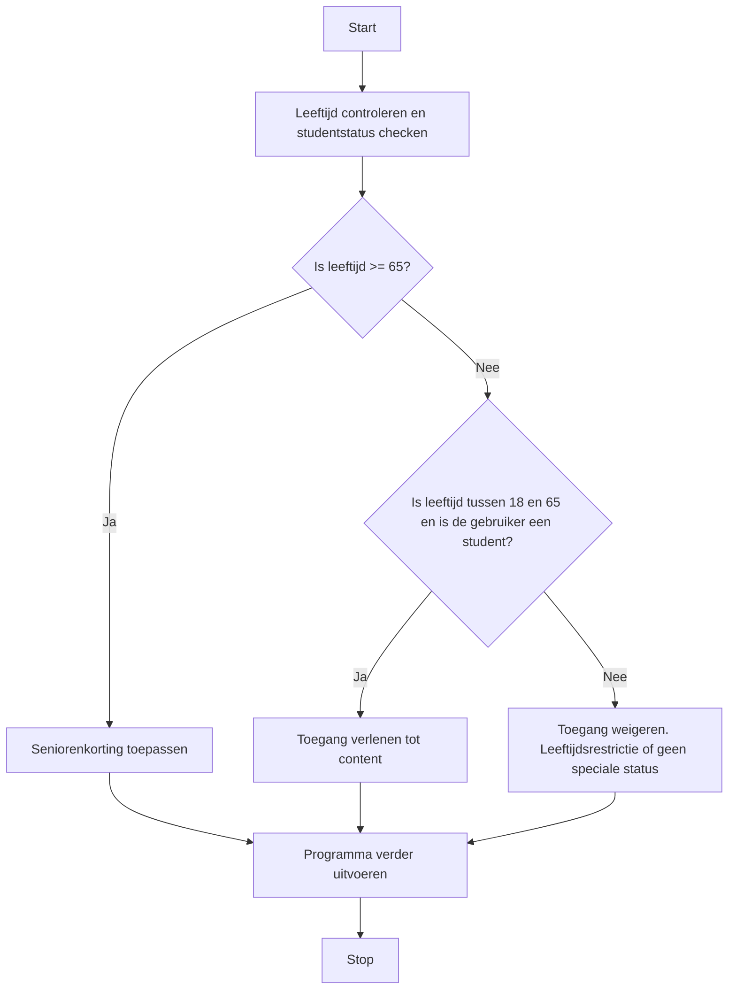

> Meer informatie over [[2. Ondersteunende-informatie/3. Processen/4. Implementatieproces/2. Bouwen softwaresysteem/If-else/1. If-Else|If-else]]

## Stappen in de Systematische Probleem Aanpak
### 1. Doel
Bepaal de reden voor het gebruik van een *If-Else*-structuur. Bijvoorbeeld: Het programma moet beslissingen kunnen nemen op basis van invoer of andere data.

### 2. Subdoelen
Splits het probleem in subdoelen, zoals:
  - Het vaststellen van de conditie(s) die getoetst moet worden.
  - Het formuleren van de actie(s) die gedaan moeten worden op basis van de conditie(s).

> [!info] Tip 
> Het vaststellen van de condities en acties kan je erg eenvoudig inventariseren door er een tabel van te maken. In de linker kolom zet je dan de conditie en in de rechter kolom de actie die bij de conditie hoort. 

>[!TIP] Casus
> **Gegeven is de volgende tekst:**
> Als de leeftijd van een persoon 65 jaar of ouder is, moet er een seniorenkorting worden toegepast. Als de leeftijd van een persoon jonger is dan 18 jaar en er geen speciale status is, moet de toegang worden geweigerd. Voor personen van 18 jaar en ouder, maar jonger dan 65 jaar, of met een speciale status, moet de toegang worden verleend.
>
> **Zet deze tekst om in een tabel:**
> 
> | Conditie                                    | Actie                   |
> | ------------------------------------------- | ----------------------- |
> | Als leeftijd >= 65                          | Seniorenkorting toepassen |
> | Als leeftijd < 18 en geen speciale status   | Toegang weigeren        |
> | Als leeftijd >= 18 en < 65 of speciale status | Toegang verlenen        |

### 3. Fasen:
1. **Parameters/Variabelen Identificeren**  
   **Actie**: Identificeer de parameters of variabelen waarop de If-Else-structuur zal controleren.  
   **Resultaat**: Gedefinieerde variabele(n) zoals `leeftijd` of `specialeStatus`.

2. **Waardes Analyseren**  
   **Actie**: Bepaal de mogelijke waarden die de variabelen kunnen aannemen en waarop de condities gebaseerd moeten worden.  
   **Resultaat**: Een lijst van mogelijke waarden, zoals leeftijden (bijv. 65+ voor senioren, 18+ voor volwassenen).

3. **Condities Analyseren**  
   **Actie**: Identificeer de condities waarop beslissingen moeten worden gebaseerd.  
   **Resultaat**: Overzicht van condities, zoals "leeftijd >= 18" of "isStudent".

4. **Acties per Conditie Bepalen**  
   **Actie**: Specificeer welke actie het programma moet uitvoeren als een bepaalde conditie waar is, en welke actie indien onwaar.  
   **Resultaat**: Acties gekoppeld aan condities.

5. **Bouw de If-Else-structuur in Code**  
   **Actie**: Implementeer de If-Else-structuur op basis van de eerder bepaalde condities en acties.  
   **Resultaat**: Een volledige If-Else-structuur met logische condities en bijbehorende acties.

6. **Test en Valideer**  
   **Actie**: Test de If-Else-structuur met verschillende invoerwaarden om te verifiëren dat de structuur correct werkt.  
   **Resultaat**: Een gevalideerde If-Else-structuur die gewenste uitkomsten levert.

### Correctieve feedback tijdens de uitvoer
#### Fouten detecteren
Bij een foutmelding, zoals een onverwachte uitkomst, herken je de fout door te kijken naar de specifieke conditie die mogelijk onjuist is gedefinieerd. 
- **Fout in logica**: Als een conditie niet correct werkt, controleer of de operatoren de juiste relatie tussen voorwaarden aangeven. Bijvoorbeeld, verander `&&` naar `||` als dat nodig is.
- **Fout in syntax**: Zorg ervoor dat alle haakjes correct zijn geplaatst om de volgorde van evaluatie te waarborgen. Gebruik bijvoorbeeld `((conditie1 && conditie2) || conditie3)` voor duidelijkheid.

> [!INFO] Tip  
> Bij het testen en valideren is het belangrijk om zowel verwachte als onverwachte input te proberen, zodat eventuele fouten in de If-Else-logica tijdig gedetecteerd kunnen worden.

### Tips voor efficiënt gebruik van If-Else-structuren
- **Vermijd overmatige If-Else-structuren** door te overwegen of `else if`-clausules of `switch`-cases effectiever zijn.
- **Gebruik haakjes** om complexe logica duidelijk te structureren, wat bijdraagt aan de leesbaarheid.
- **Test met flowcharts** voor overzicht bij meerdere if-else regels, zoals:

---

> Volgende stap: [[4. Deeltaken/3. Processen/4. Implementatieproces/2. Bouwen softwaresysteem/1. If-Else|Deeltaken]]
