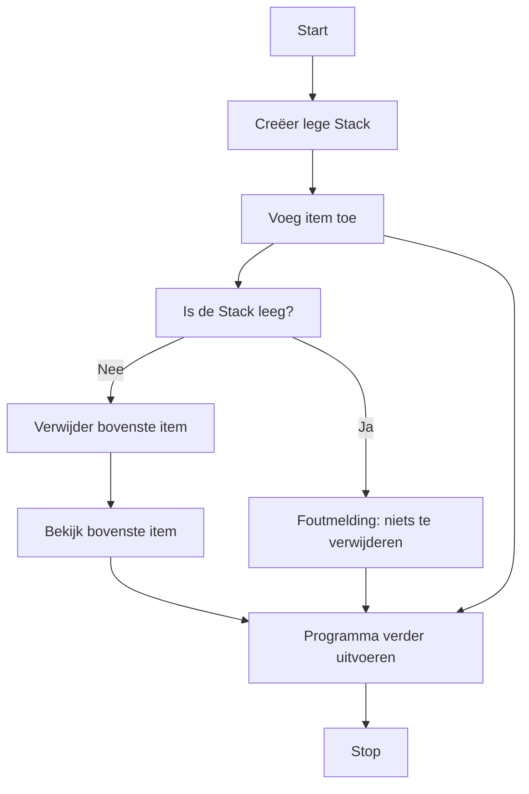

> Meer informatie over [[1. Uitleg Stack|Stack]]

## Stappen in de Systematische Probleem Aanpak

### 1. Doel
Bepaal de reden voor het gebruik van een **Stack**-structuur. Bijvoorbeeld: Het programma moet gegevens op een gestructureerde manier kunnen toevoegen en verwijderen volgens het LIFO-principe (Last In, First Out).

### 2. Subdoelen
Splits het probleem in subdoelen, zoals:
- Parameters/variabelen identificeren
- Waardes analyseren
- Acties identificeren
- Regels voor acties bepalen
- **Stack** implementeren in code
- Test en valideer

> [!info] Tip
> Het vaststellen van gegevens en acties kan eenvoudig worden geïllustreerd met een tabel. In de linker kolom beschrijf je de actie, en in de rechter kolom de bijbehorende beschrijving.

> [!TIP] Casus
> **Gegeven is de volgende tekst:**  
Een programma beheert een stapel boeken. Boeken worden toegevoegd aan de stapel totdat een bepaald maximum is bereikt. Het bovenste boek kan worden verwijderd als dat nodig is. Er moet ook een optie zijn om te zien welk boek bovenop de stapel ligt zonder het te verwijderen.
>
> **Zet deze tekst om in een tabel:**
> 
> | Actie                                    | Beschrijving                   |
> | ------------------------------------------- | ----------------------- |
> | Boeken toevoegen                          |  Voeg een nieuw boek toe aan de stapel *(Push)*. |
> | Bovenste boek verwijderen   | Haal het bovenste boek van de stapel *(Pop)*.        |
> | Bovenste boek bekijken | Toon het bovenste boek zonder het te verwijderen *(Peek)*.       |

### 3. Fasen
1. **Parameters/variabelen identificeren**  
	**Actie**: Bepaal welke gegevens in de **Stack** worden opgeslagen.  
	**Resultaat**: Gedefinieerde variabele zoals `boekenStap`

2. **Waardes analyseren**  
	**Actie**: Identificeer de waarden die de variabele kan bevatten.  
	**Resultaat**: Een lijst van boeken, bijvoorbeeld `["Boek A", "Boek B", "Boek C"]`.

3.  **Acties identificeren**  
	**Actie**: Bepaal de mogelijke acties, zoals toevoegen, verwijderen of bekijken van de bovenste waarde in de **Stack**.  
	**Resultaat**: Een overzicht van acties: _Push_, _Pop_ en _Peek_.

4. **Regels voor acties bepalen**  
	**Actie**: Specificeer welke acties mogelijk zijn en onder welke voorwaarden (bijvoorbeeld: geen _Pop_ als de **Stack** leeg is).  
	**Resultaat**: Actieregels, zoals "Niet _Pop_ uitvoeren als de **Stack** leeg is".

5. **Stack implementerern in code**  
	**Actie**: Bouw de **Stack**-structuur in code en implementeer de acties.  
	**Resultaat**: Een werkende **Stack** met functies voor _Push_, _Pop_ en _Peek_.

6. **Test en valideer**  
	**Actie**: Test de **Stack**-structuur met verschillende acties om de correctheid te waarborgen.  
	**Resultaat**: Een gevalideerde **Stack**-implementatie die voldoet aan de eisen.
	
### Correctieve feedback tijdens de uitvoer
#### Fouten detecteren
Bij een fout in de werking van de **Stack** kun je kijken naar specifieke acties die mogelijk niet correct zijn geïmplementeerd.
- **Fout in logica**: Controleer of de regels, zoals een lege **Stack** niet _Pop_-pen, correct zijn geïmplementeerd.
- **Fout in syntax**: Controleer de methodes voor consistentie, bijvoorbeeld dat bij _Push_ een item daadwerkelijk wordt toegevoegd aan het einde van de lijst.

> [!INFO] Tip  
Test je **Stack** met zowel verwachte als onverwachte acties (zoals een _Pop_ op een lege **Stack**) om fouten vroegtijdig te ontdekken.

### Tips voor efficiënt gebruik van Stack
- **Controleer vooraf of de Stack leeg is:** Hiermee voorkom je fouten bij_Pop_ of _Push_.
- **Gebruik methodes:** Met methodes zoals _IsEmpty()_ kan de toestand van de **Stack** geverifieerd worden.
- **Let op bij het maken van loops en vullen van Stacks:** Zorg ervoor dat je geen *Stack overflow* laat ontstaan.
- **Test met flowcharts** voor overzicht bij meerdere controles, zoals:

---

> Volgende stap: [[3. Oefeningen Stack|Oefeningen Stack]]