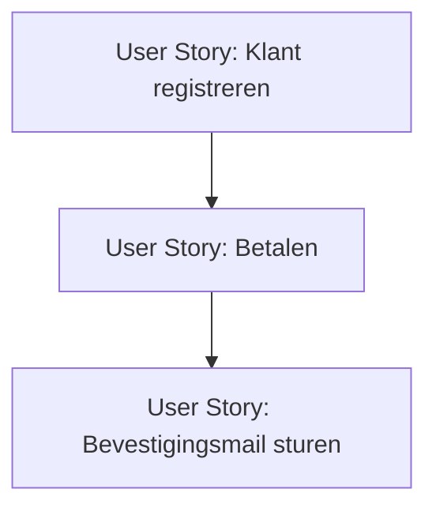

## Wat is het in kaart brengen van afhankelijkheden?

**Afhankelijkheden in softwareontwikkeling** zijn relaties tussen taken, user stories of componenten waarbij het ene onderdeel pas uitgevoerd kan worden als een ander onderdeel beschikbaar of afgerond is. Het in kaart brengen van deze afhankelijkheden helpt teams om risico’s en bottlenecks vroegtijdig te signaleren en realistische keuzes te maken bij de planning van het werk.

> [!TIP] Casus  
> Een team werkt aan een webshop. Het bouwen van de betaalfunctie is afhankelijk van de oplevering van de klantregistratie. Zonder geregistreerde klant kan er immers geen betaling plaatsvinden. Door deze afhankelijkheid expliciet te maken, voorkomt het team dat een story te vroeg in de sprint wordt gepland.

## Hoe zit het in kaart brengen van afhankelijkheden in elkaar?
Het proces bestaat meestal uit drie onderdelen:
1. **Identificeren van afhankelijkheden:**
    - Welke user stories of taken kunnen pas starten na een ander onderdeel?
    - Zijn er afhankelijkheden met externe teams, leveranciers of systemen?
2. **Visualiseren van afhankelijkheden:**
    - Gebruik van **dependency boards**, pijlen in een backlog-tool of diagrammen (bijvoorbeeld in een UML of C4-model) om afhankelijkheden zichtbaar te maken.
    - Vaak worden kleuren of labels gebruikt om kritieke afhankelijkheden te markeren.
3. **Analyseren van impact:**
    - Welke gevolgen hebben de afhankelijkheden voor de sprintplanning?
    - Zijn er mogelijkheden om afhankelijkheden te verminderen (bijvoorbeeld door stories te splitsen of mock-data te gebruiken)?
### Diagramvoorbeeld

Dit eenvoudige diagram laat zien dat "Betalen" afhankelijk is van "Klant registreren" en dat "Bevestigingsmail sturen" pas na "Betalen" kan plaatsvinden.
## Hoe gebruik je het in kaart brengen van afhankelijkheden?
Het in kaart brengen van afhankelijkheden wordt vooral gebruikt:
- Tijdens **refinement** om te bepalen welke stories klaar zijn om ingepland te worden.
- Bij **sprintplanning** om te zien welke combinaties van stories haalbaar zijn.
- In de dagelijkse samenwerking om transparantie te bevorderen: afhankelijkheden zijn zichtbaar voor alle teamleden en stakeholders.

> [!TIP] Casus  
> In een project voor een onderwijsapp worden de volgende afhankelijkheden gevonden:
> 
> - Story "Resultaten tonen aan student" kan pas als "Resultaten invoeren door docent" beschikbaar is.
>     
> - Story "Notificatie sturen bij nieuw resultaat" is afhankelijk van beide eerdere stories.
>     
> 
> Eisen:
> 
> - Alle afhankelijkheden moeten visueel gemaakt worden.
>     
> - Het team bespreekt bij de sprintplanning of een story met afhankelijkheden haalbaar is.
>     
> - Externe afhankelijkheden (bijvoorbeeld koppeling met een bestaand systeem) moeten apart benoemd en gemonitord worden.
>     

**Mogelijke uitwerking van de casus**

Indien bronnen:

> [!info] Bronnen
> 
> - Nicole de Swart, _Handboek requirements_ (2022)
>     
> - Scrum Guide (2020)
>     

---

> Volgende stap: [[4. Uitleg kiezen user stories|Uitleg kiezen user stories]]
