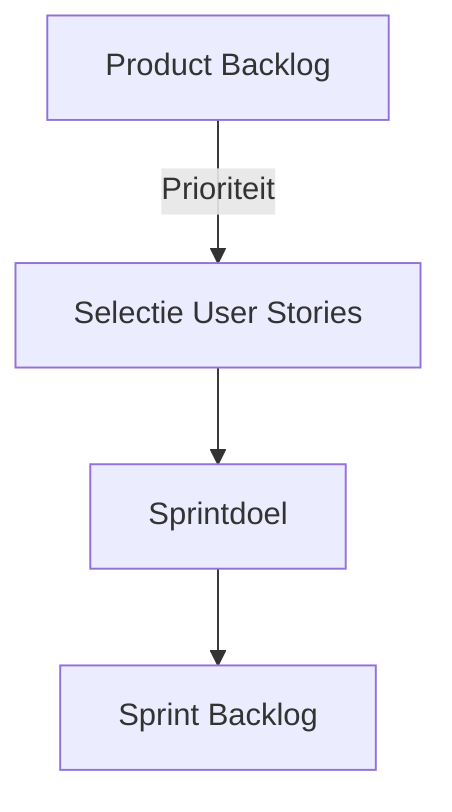

## Wat is het kiezen van user stories?
Het **kiezen van user stories** is het proces waarbij een Scrumteam bepaalt welke items uit de product backlog worden geselecteerd om in de sprint backlog op te nemen. User stories beschrijven gewenste functionaliteit vanuit het perspectief van de gebruiker. Door de juiste selectie te maken, kan het team bijdragen aan het behalen van het sprintdoel én voortgang boeken richting het productdoel.

> [!TIP] Casus  
> Stel, een ontwikkelteam werkt aan een leerplatform. Op de product backlog staan user stories voor zowel de registratiefunctionaliteit, een zoekfunctie, als een notificatiesysteem. Tijdens de sprint planning moet het team keuzes maken. Ze kijken naar waarde voor de gebruiker, afhankelijkheden met andere stories, en de beschikbare capaciteit. Uiteindelijk kiezen ze een set stories die samen leiden tot een bruikbaar increment.
## Hoe zit het kiezen van user stories in elkaar?
Het selecteren van user stories hangt samen met verschillende factoren:
1. **Waarde voor de gebruiker**  
    User stories die direct bijdragen aan klantwaarde of bedrijfsdoelen hebben prioriteit.
2. **Afhankelijkheden**  
    Sommige stories kunnen pas worden gerealiseerd als andere stories voltooid zijn. Het in kaart brengen van afhankelijkheden helpt bij het maken van een logische keuze.
3. **Schatting van werklast**  
    Elke story wordt ingeschat (bijvoorbeeld met story points). Het team moet zorgen dat de totale werklast aansluit bij de beschikbare capaciteit voor de sprint.
4. **Risico’s en onzekerheden**  
    Het kan zinvol zijn om stories te kiezen die onzekerheid of technisch risico wegnemen, zodat latere sprints soepeler verlopen.
5. **Samenhang met het sprintdoel**  
    De gekozen stories moeten een logisch geheel vormen en bijdragen aan een duidelijk sprintdoel.

### Voorbeeld in diagram

## Hoe gebruik je kiezen van user stories?
Je gebruikt het **kiezen van user stories** tijdens de sprint planning om te bepalen welk werk haalbaar en waardevol is. Dit gebeurt in samenwerking tussen de product owner en het development team.
- De **product owner** brengt prioriteiten en waarde in.
- Het **development team** beoordeelt haalbaarheid, werklast en afhankelijkheden.
- Samen zorgen ze dat de sprint backlog realistisch is en dat deze het sprintdoel ondersteunt.

> [!TIP] Casus  
> In een e-commerce project wil de product owner dat de betaalfunctie zo snel mogelijk werkt. Het team ziet echter dat eerst de productcatalogus stabiel moet zijn. Ze besluiten de stories voor catalogusbeheer en winkelwagenbeheer in deze sprint op te nemen. Eisen:
> 
> - Stories sluiten aan bij het sprintdoel.
>     
> - Stories passen binnen de capaciteit.
>     
> - Stories zijn duidelijk omschreven en haalbaar.
>     

**Mogelijke uitwerking van de casus**
- Story 1: Als klant wil ik producten kunnen filteren op categorie.
- Story 2: Als klant wil ik producten aan mijn winkelwagen kunnen toevoegen.
- Story 3: Als beheerder wil ik producten kunnen beheren in de catalogus.
    
---

> Volgende stap: [[5. Aanpak kiezen van user stories|Aanpak kiezen van user stories]]
