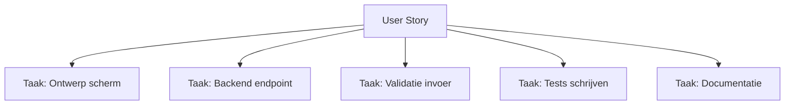

## Wat is taken toevoegen aan een user story?
**Taken toevoegen aan een user story** betekent dat een user story wordt opgesplitst in kleine, overzichtelijke werkzaamheden. Deze taken beschrijven welke stappen nodig zijn om de user story te realiseren en vormen samen met de user story de inhoud van de sprint backlog. Door deze taken zichtbaar te maken, ontstaat een concreet plan voor de uitvoering van het werk.

> [!TIP] Casus  
> Een user story luidt: _"Als gebruiker wil ik kunnen inloggen zodat ik toegang heb tot mijn persoonlijke gegevens."_  
> Het team splitst deze user story op in taken, zoals het maken van een inlogscherm, het bouwen van een authenticatie-endpoint en het schrijven van tests.

## Hoe zit taken toevoegen aan een user story in elkaar?
Het toevoegen van taken gebeurt meestal tijdens de sprint planning, maar kan ook tijdens de sprint worden aangevuld. Een taak is klein genoeg om binnen een dag afgerond te worden. Vaak worden er tussen de vijf en tien taken aan een user story gekoppeld.

De indeling van taken volgt meestal deze structuur:
- **Analyse en ontwerp:** wat moet er technisch of functioneel worden uitgewerkt?
- **Implementatie:** het bouwen of aanpassen van componenten.
- **Testen:** het schrijven en uitvoeren van tests.
- **Ondersteuning:** documentatie of reviewtaken.
Taken worden gekoppeld aan de user story zodat duidelijk blijft welke werkzaamheden bijdragen aan het realiseren van de gewenste functionaliteit.
## Hoe gebruik je taken toevoegen aan een user story?
Het team gebruikt **taken toevoegen aan een user story** om grip te krijgen op de uitvoering van het werk. Elke developer kan een taak oppakken en zichtbaar maken wat de status is. Door de voortgang van taken bij te houden, ontstaat een realistisch beeld van hoe het werk zich verhoudt tot het sprintdoel.

Taken helpen ook om afhankelijkheden zichtbaar te maken. Als bijvoorbeeld een backendtaak eerst afgerond moet worden voordat een frontendtaak kan starten, is dit eenvoudig te plannen en te volgen.

> [!TIP] Casus  
> User story: _"Als docent wil ik cijfers kunnen invoeren zodat studenten hun resultaten kunnen zien."_  
> Taken:
> 
> - Ontwerpen van invoerscherm.
>     
> - Bouwen van backend endpoint `/grades`.
>     
> - Validatie van invoer (numeriek, bereik).
>     
> - Unit- en integratietests.
>     
> - Documentatie van API.
>     

**Mogelijke uitwerking van de casus**

---

> Volgende stap: [[PI Taken toevoegen aan een user story|Stappenplan Taken toevoegen aan een user story]]

