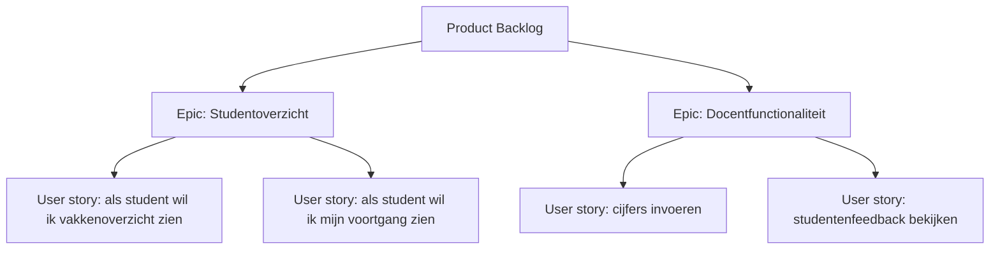

## Wat is het opstellen van de product backlog?
De **product backlog** is een geordende lijst van alles wat nodig is om waarde te leveren met het product. Het **opstellen van de product backlog** betekent dat de product owner samen met belanghebbenden en het ontwikkelteam een initiële verzameling van wensen, eisen en ideeën vastlegt. Deze lijst vormt een dynamisch geheel dat voortdurend wordt aangevuld, aangepast en geprioriteerd.

> [!TIP] Casus  
> Een softwareteam gaat een nieuwe leerapp ontwikkelen. De product owner verzamelt input van docenten, studenten en beheerders. De eerste backlog bevat items als: “als student wil ik een overzicht van mijn vakken zien” en “als docent wil ik cijfers kunnen invoeren.” Tijdens de eerste weken groeit de backlog door gesprekken en feedback, waarna de items steeds concreter en beter geordend worden.
## Hoe zit het opstellen van de product backlog in elkaar?
Het proces bestaat uit een aantal vaste onderdelen:
1. **Verzamelen van input**  
    Alle belanghebbenden leveren wensen en ideeën aan. Dit kan via workshops, interviews, observaties of bestaande documentatie.
2. **Vastleggen van backlog items**  
    Items worden geformuleerd als **user stories**, **epics** of technische taken. De focus ligt op wat waarde toevoegt voor de gebruiker.
3. **Ordenen en prioriteren**  
    De product owner bepaalt de volgorde op basis van waarde, risico, afhankelijkheden en feedback. De items bovenaan de backlog zijn het meest concreet.
4. **Continu aanvullen en bijwerken**  
    De backlog is een **levend document**. Nieuwe inzichten, veranderende prioriteiten en technische keuzes leiden tot voortdurende bijsturing.
### Voorbeeld in pseudo-codevorm
```text
Product Backlog:
1. [Hoogste prioriteit] Inloggen met schoolaccount
2. Resultatenoverzicht tonen
3. Docent kan cijfers invoeren
4. Notificaties versturen
...
```
## Hoe gebruik je het opstellen van de product backlog?
Het opstellen van de backlog gebeurt bij de start van een project, maar houdt niet op na de eerste keer. In elke sprint worden backlog items besproken, gesplitst en verder uitgewerkt in refinement-sessies.
- **Alternatieven:** In plaats van user stories kan een team kiezen voor use cases of feature-kaarten, afhankelijk van de context.
- **Koppeling:** De product backlog vormt de basis voor de sprint backlog en stuurt daarmee het werk van het ontwikkelteam.

> [!TIP] Casus  
> Voor de leerapp wordt besloten om de eerste release te richten op studenten. De product owner ordent de backlog zo dat alle functies voor studenten bovenaan komen te staan.
> 
> Eisen:
> 
> - Items zijn begrijpelijk voor zowel ontwikkelaars als belanghebbenden.
>     
> - Items hebben een duidelijke waarde voor de gebruiker.
>     
> - Items zijn te prioriteren en verfijnbaar tot sprintniveau.
>     

**Mogelijke uitwerking van de casus**



---

> Volgende stap: [[2. Uitleg prioriteren product backlog|Uitleg prioriteren product backlog]]
