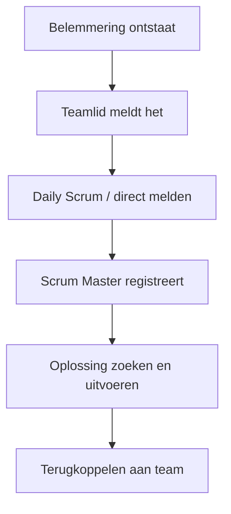

## Wat is het uiten van belemmeringen?
**Belemmeringen uiten** betekent dat teamleden actief en open aangeven welke factoren hun werk hinderen. Dit kunnen technische obstakels zijn, zoals een ontbrekende tool, maar ook organisatorische of persoonlijke zaken, zoals onduidelijke requirements of conflicterende prioriteiten. In SCRUM wordt dit vaak besproken tijdens de **Daily Scrum** en zichtbaar gemaakt op een **Impediment Board**.

Buiten SCRUM geldt dat **belemmeringen uiten** essentieel is voor een gezonde samenwerking: het vergroot transparantie, bevordert vertrouwen en stelt een organisatie in staat sneller oplossingen te vinden.

> [!TIP] Casus  
> Tijdens een sprint merkt een developer dat het testplatform traag is. In plaats van te wachten tot de sprintreview meldt hij dit direct in de Daily Scrum. De Scrum Master neemt de belemmering mee en zorgt dat er tijdelijk extra testcapaciteit beschikbaar komt. Zo kan het team verder zonder vertraging.

## Hoe zit uiten van belemmeringen in elkaar?
**Belemmeringen uiten** kent drie kernaspecten:

1. **Wat**
    - Belemmeringen kunnen technisch, organisatorisch of persoonlijk zijn.  
    - Voorbeelden: bugs in cruciale software, ontbrekende informatie, afhankelijkheid van een andere afdeling, conflicterende taken.
2. **Wanneer**
    - In SCRUM: dagelijks tijdens de **Daily Scrum** en zodra een belemmering zich voordoet.
    - In het algemeen: zo vroeg mogelijk, om escalatie te voorkomen.
3. **Hoe**
    - Kort en concreet formuleren, zonder schuldvraag.
    - Transparant delen in het team en vastleggen op een zichtbaar medium (bijvoorbeeld een impediment board of digitaal tool).
    - Samen zoeken naar een oplossing, waarbij de **Scrum Master** vaak een ondersteunende rol heeft.
### Voorbeeldformulering
- “Ik kan mijn taak niet afronden omdat de API niet bereikbaar is.”
- “Ik heb meer duidelijkheid nodig over de acceptatiecriteria voordat ik verder kan.”
## Hoe gebruik je uiten van belemmeringen?
Je gebruikt **belemmeringen uiten** als vast onderdeel van samenwerking en communicatie. In SCRUM hoort het bij de **Daily Scrum**, maar ook buiten de ceremonie moeten obstakels direct gedeeld worden. Alternatieven zijn een dedicated impediment channel in Slack/Teams of een fysiek bord op de werkvloer.

> [!TIP] Casus  
> Een teamlid meldt steeds pas laat dat hij afhankelijk is van een externe partij. Hierdoor komt de sprintdoelstelling in gevaar. Het team besluit een duidelijke werkafspraak te maken: belemmeringen worden binnen een dag gemeld en op het impediment board gezet.

**Mogelijke uitwerking van de casus**
- Werkafspraak: “Belemmeringen uiterlijk binnen 24 uur melden.”
- Gebruik van een impediment board met drie kolommen: _Nieuw – In behandeling – Opgelost_.
- Regelmatige evaluatie tijdens de sprint retrospective om patronen te herkennen.

Indien bronnen:

> [!info] Bronnen  
> Scrum Guide (2020), sectie Daily Scrum en rol van de Scrum Master  

---

> Volgende stap: [[3. Uitleg inzichtelijk maken voortgang|Uitleg inzichtelijk maken voortgang]]
