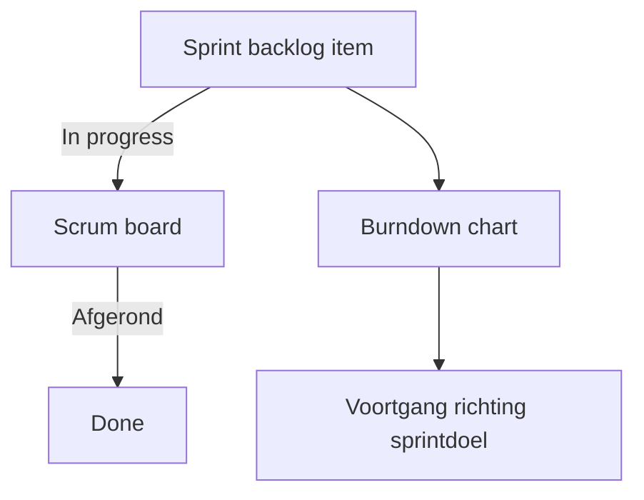

## Wat is inzichtelijk maken van de voortgang?
**Inzichtelijk maken van de voortgang** betekent dat een team de status van werkzaamheden en de mate van realisatie van doelen zichtbaar en begrijpelijk maakt voor alle belanghebbenden. Binnen SCRUM gaat het daarbij vooral om het zichtbaar maken van de voortgang richting het sprintdoel en productdoel. Dit vergroot transparantie en maakt tijdige bijsturing mogelijk.

> [!TIP] Casus  
> Een SCRUM-team werkt aan een nieuwe mobiele app. Tijdens de sprint merkt de Product Owner dat de voortgang niet duidelijk is voor stakeholders. Door gebruik te maken van een burndown chart en een visueel Scrum board kunnen de stakeholders precies zien hoeveel werk er al gedaan is en hoeveel er nog over is. Hierdoor ontstaat een realistisch beeld van de oplevering.

## Hoe zit inzichtelijk maken van de voortgang in elkaar?
Het inzichtelijk maken van de voortgang kent meerdere vormen en middelen:
1. **Visuele hulpmiddelen:**
    - Scrum board (fysiek of digitaal) met kolommen zoals _To do_, _In progress_ en _Done_.  
    - Burndown- of burnupcharts die trends in het resterende werk tonen. 
2. **Transparantie in events:**
    - Dagelijkse SCRUM (Daily Scrum) waarin het team bespreekt wat al gedaan is, wat nog resteert en welke belemmeringen er zijn.
    - Sprint Review waarin de voortgang richting productdoel zichtbaar wordt gemaakt aan stakeholders.
3. **Traceerbaarheid:**
    - Alle items op de product- en sprintbacklog hebben een duidelijke status.
    - Koppeling van voortgang aan het sprintdoel en productdoel.

### Voorbeeld visualisatie in mermaid

## Hoe gebruik je inzichtelijk maken van de voortgang?
**Inzichtelijk maken van de voortgang** wordt toegepast gedurende de hele sprint.
- Tijdens de **Daily Scrum** gebruikt het team het board om gezamenlijke status te bepalen.
- De **Scrum Master** faciliteert dat de voortgang open en transparant is, zodat obstakels tijdig zichtbaar worden.
- In de **Sprint Review** wordt de gerealiseerde voortgang getoond met werkende software en ondersteund met visuele overzichten.

> [!TIP] Casus  
> Een stakeholder wil weten of een bepaalde functionaliteit op tijd af is. Het team toont het Scrum board: de taak staat al in _Done_. Daarnaast laat de burndown chart zien dat het team keurig op schema ligt.

**Mogelijke uitwerking van de casus**
- Scrum board in Jira of Miro met taken per teamlid.
- Burndown chart waarin nog 12 story points te gaan zijn van de oorspronkelijke 40.

---

> Volgende stap: [[4. Uitleg oplossen belemmeringen|Uitleg oplossen belemmeringen]]
