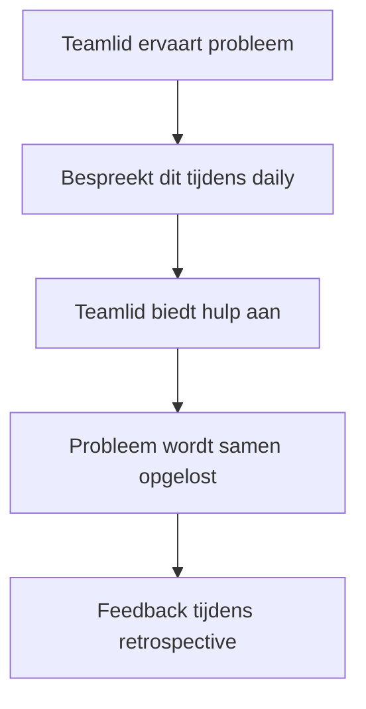

## Wat is ondersteunen van een teamlid?

**Ondersteunen van een teamlid** binnen SCRUM betekent dat je actief bijdraagt aan het welzijn, de effectiviteit en de motivatie van een collega in het team. Het gaat hierbij niet alleen om praktische hulp, zoals het beantwoorden van vragen of het meedenken over een oplossing, maar juist ook om **sociale ondersteuning**: luisteren, aanmoedigen en zorgen voor een veilige en open werksfeer.

In SCRUM is het team **zelforganiserend**. Dit betekent dat er geen leidinggevende is die aangeeft wat iedereen moet doen — de teamleden dragen gezamenlijk verantwoordelijkheid. Daarom is het belangrijk dat teamleden elkaar ondersteunen, zodat iedereen goed kan bijdragen aan het sprintdoel.

> [!TIP] Casus  
> Tijdens de sprint merkt een ontwikkelaar dat een teamlid vastloopt bij een complexe user story. In plaats van af te wachten, vraagt ze hoe ze kan helpen. Ze plannen samen een korte pair programming-sessie. Hierdoor voelt het teamlid zich gesteund, leert hij nieuwe inzichten en blijft de voortgang op schema.

## Hoe zit ondersteunen van een teamlid in elkaar?

Ondersteunen van een teamlid kan worden gezien vanuit drie sociale invalshoeken: **emotioneel**, **praktisch** en **ontwikkelend**.

1. **Emotionele ondersteuning**
    
    - Toon betrokkenheid en empathie. Vraag hoe het gaat, niet alleen met het werk, maar ook persoonlijk als dat passend is.
        
    - Geef waardering voor inspanning, ook als het resultaat nog niet perfect is.
        
    - Gebruik positieve communicatie, zoals “Wat heb je al geprobeerd?” in plaats van “Waarom werkt dit nog niet?”.
        
2. **Praktische ondersteuning**
    
    - Bied hulp aan bij concrete taken, bijvoorbeeld door samen te debuggen, testcases door te nemen of een planning te herzien.
        
    - Deel kennis en ervaringen, zeker als iemand nieuw is of minder ervaring heeft met een onderdeel van de sprint.
        
    - Verwijs, indien nodig, naar anderen binnen het team met relevante expertise.
        
3. **Ontwikkelende ondersteuning**
    
    - Moedig teamleden aan om te leren van fouten en geef constructieve feedback tijdens retrospectives.
        
    - Stimuleer kennisdeling door bijvoorbeeld korte demo’s of code reviews.
        
    - Gebruik de **Scrumwaarden** (focus, respect, openheid, moed en betrokkenheid) als richtlijn bij samenwerking.
        

### Belang binnen SCRUM

In SCRUM draagt wederzijdse ondersteuning direct bij aan het behalen van het **sprintdoel**. Wanneer teamleden elkaar helpen, vermindert de kans op blokkades en neemt de productiviteit toe. Tijdens de **Daily Scrum** worden belemmeringen besproken, waarbij ondersteuning vanzelfsprekend onderdeel is van de samenwerking: als één teamlid vastloopt, helpt het team om de blokkade weg te nemen.

Daarnaast komt ondersteuning terug tijdens de **Retrospective**. Daar reflecteert het team op de samenwerking en bespreekt hoe ze elkaar beter kunnen helpen in de volgende sprint.

## Hoe gebruik je ondersteunen van een teamlid?

Ondersteunen van een teamlid vraagt om **actieve sociale vaardigheden**: luisteren, vragen stellen en positief feedback geven. Dit doe je niet pas als iemand om hulp vraagt, maar door alert te zijn op signalen in de samenwerking.

> [!TIP] Casus  
> Tijdens de daily stand-up zegt een tester: “Ik ben nog bezig met de testautomatisering, maar ik loop vast op de configuratie.” Een developer reageert: “Zal ik vanmiddag even meekijken? Dan lossen we het samen op.”
> 
> **Eisen voor effectief ondersteunen:**
> 
> - Luister actief en zonder oordeel.
>     
> - Bied concrete hulp of stel een vervolgstap voor.
>     
> - Respecteer de autonomie van de ander: bied hulp aan, maar neem het werk niet over.
>     
> - Geef positieve feedback wanneer iemand initiatief toont.
>     

**Mogelijke uitwerking van de casus**  
Het team besluit een korte werkafspraak te maken: als iemand vastloopt, bespreekt die dit tijdens de daily of direct met een collega. Daardoor blijven problemen niet liggen en leert iedereen sneller van elkaar.

## Tips voor sociaal en positief ondersteunen

- Luister meer dan je praat: stel open vragen.
    
- Geef waardering: kleine complimenten versterken teamvertrouwen.
    
- Deel kennis zonder neerbuigendheid.
    
- Help collega’s om zelf tot inzicht te komen in plaats van het probleem over te nemen.
    
- Houd rekening met communicatiestijlen; niet iedereen vraagt hulp op dezelfde manier.
    
- Gebruik humor en vriendelijkheid om spanning te verminderen.
    
- Herken wanneer iemand overbelast is en bespreek dit met respect.
    

---

> Volgende stap: [[1. Uitleg werk presenteren|Uitleg werk presenteren]]