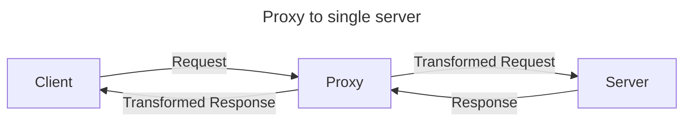
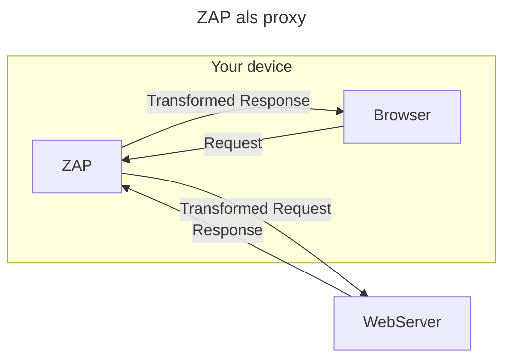

Om duidelijk te maken hoe ZAP in elkaar zit, wordt eerst uitgelegd wat een proxy is.
## Proxy
Een proxy werkt als een tussenstap tussen een client en een server. Wanneer een client een verzoek (request) naar een server stuurt, kan dit verzoek eerst naar een proxy worden gestuurd. De proxy ontvangt het verzoek, evalueert en transformeert het indien nodig, en stuurt het vervolgens door naar de server. De server verwerkt het verzoek en stuurt een respons terug naar de proxy, die de respons vervolgens terugstuurt naar de client. Deze tussenstap biedt verschillende voordelen en mogelijkheden, zoals:

- **Veiligheid**: Een proxy kan fungeren als een firewall, verzoeken filteren en voorkomen dat kwaadaardige verzoeken de server bereiken.
- **Privacy**: Door het gebruik van een proxy kunnen de IP-adressen van de clients worden verborgen, wat helpt bij het beschermen van de privacy.
- **Caching**: Proxies kunnen veelgevraagde inhoud opslaan (cachen), waardoor de tijd die nodig is om deze inhoud aan de client te leveren, wordt verkort.
- **Load Balancing**: Proxies kunnen het inkomende verkeer verdelen over meerdere servers, waardoor de belasting gelijkmatig wordt verdeeld en de prestaties worden verbeterd.
- **Inhoud Manipulatie**: Proxies kunnen verzoeken en reacties aanpassen, zoals het toevoegen van headers, het omzetten van HTTPS naar HTTP, en het uitvoeren van authenticatie.

Een proxy ziet er uit als volgt:

![[zap_proxy1.png]]

%%

%%

## ZAP als proxy
ZAP is een gespecialiseerde proxy ontworpen voor het testen van webapplicaties op beveiligingskwetsbaarheden. In plaats van zich te richten op het beveiligen van gegevens of het optimaliseren van netwerkverkeer, is ZAP gericht op het identificeren, analyseren en exploiteren van mogelijke beveiligingsproblemen. Dit doet ZAP door de volgende taken uit te voeren:

- **Inspecteren**: ZAP kan inkomende en uitgaande HTTP/HTTPS-verzoeken en -reacties bekijken, vastleggen en analyseren. Dit maakt het mogelijk om te zien welke gegevens tussen de client en de server worden uitgewisseld.
- **Manipuleren**: ZAP kan verzoeken en reacties onderweg wijzigen. Dit kan worden gebruikt om te testen hoe de webapplicatie reageert op onverwachte of kwaadaardige invoer.
- **Scannen**: ZAP bevat functies voor het automatisch scannen van webapplicaties om bekende kwetsbaarheden te identificeren, zoals SQL-injecties, cross-site scripting (XSS), en meer. Bij een passieve scan observeert ZAP het verkeer zonder het te wijzigen. Bij een actieve scan stuurt ZAP speciaal geconstrueerde verzoeken naar de applicatie om kwetsbaarheden op te sporen.

ZAP als proxy ziet er als volgt uit:
![[zap_proxy2.png]]

> [!info]- Begrippenlijst
>- **Proxy**: Een tussenstap tussen client en server.
>- **Cachen**: Veelgebruikte resources tijdelijk opslaan, zodat ze sneller op te halen zijn.

> [!quote]- Bronnen
 >- https://en.wikipedia.org/wiki/Proxy_server
 >- https://www.fortinet.com/resources/cyberglossary/proxy-server
 
---
> Volgende stap: [[3. Hoe werkt ZAP|Hoe werkt ZAP?]]