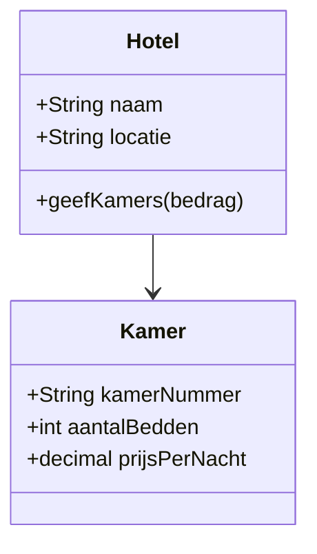
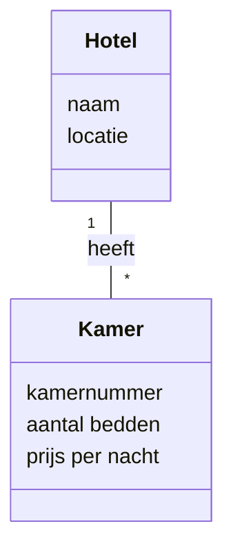
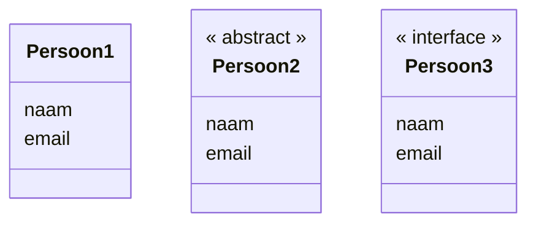
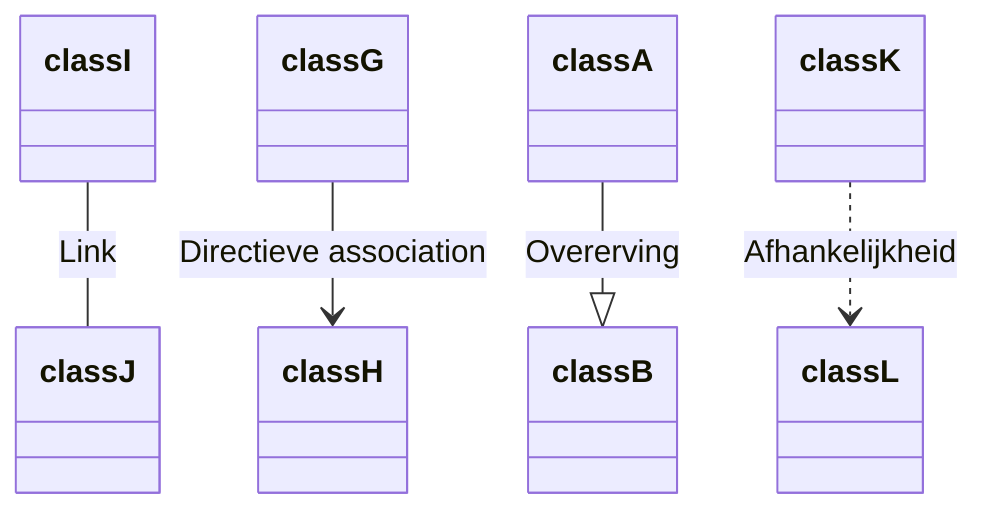

---
title:
  - Het klassendiagram
tags:
  - UML
  - Klassendiagram
difficulty: 2
taxonomie:
  - oo-15.1.Klassendiagram.OI
  - oo-15.2.Klassendiagram.OI
---

## Wat is een klassendiagram

Het klassendiagram is een ontwerptechniek voor het modelleren van de zogenaamde `structuur` van een softwaresysteem. Het bevat informatie over de `eigenschappen`(attributen) en het `gedrag` (methoden) van de klassen in het systeem. Ook bevat het diagram informatie over de `samenhang` (relaties) tussen de diverse klassen. 

Onderstaand diagram is een voorbeeld van een klassendiagram. Hierin zie je de structuur van een eenvoudig hotel softwaresysteem. 

*Diagram 1: een eenvoudig voorbeeld van een klassendiagram*

## Hoe zit het klassendiagram in elkaar

Klassendiagrammen kun je tegenkomen in een `functioneel ontwerp` en in een `technisch ontwerp`. In een functioneel ontwerp komt geen techniek voor. Je opdrachtgever of eindgebruiker zal een klassendiagram dat in een functioneel ontwerp is opgenomen kunnen begrijpen. Het beschrijft het domein waarvoor we een applicatie gaan maken. We noemen een dergelijk klassendiagram dan ook een `domeinmodel`.

Door het opstellen van een domeinmodel krijg je inzicht in het domein (b.v. een hotelketen) waarvoor je het systeem gaat ontwikkelen.

Door het opstellen van een technisch klassendiagram krijg je inzicht in de structuur van je applicatie. Dit gaat zowel over het domein als over de technische werking.

`Diagram 1` was een voorbeeld van een technisch klassendiagram. Hieronder vind je een voorbeeld van het bijbehorende domeinmodel.

*Diagram 2: een eenvoudig voorbeeld van een klassendiagram. In dit geval een domeinmodel. *

## Hoe gebruik je het klassendiagram
Het klassendiagram kun je op verschillende manieren in je development cyclus gebruiken.

| Toepassing   | Toelichting                                                                                                                                                                                                                                                                                                                                  |
| ------------ | -------------------------------------------------------------------------------------------------------------------------------------------------------------------------------------------------------------------------------------------------------------------------------------------------------------------------------------------- |
| Brainstorm   | Het klassendiagram maak je wellicht veelal digitaal maar de syntax is generiek. Als je met je collega's zoekt naar de best passende oplossing voor een probleem is de syntax uitstekend geschikt om op een whiteboard toe te passen.                                                                                                         |
| Analyse      | Bij het onderzoeken van je probleemdomein doe je allerlei inzichten op. Bijvoorbeeld welke informatie een rol speelt bij het probleemdomein. Het klassendiagram is dan een effectieve methode om dit vast te leggen. Dit zelfde model kun je gebruiken om je ideeën aan te scherpen of bij te stellen om zo tot een beter model te komen. |
| Afstemming   | Het klassendiagram is een effectief middel om af te stemmen tussen stakeholders. Een eenvoudig model(zoals het domeinmodel) gebruik je in gesprek met je klant. Complexere modellen gebruik je om af te stemmen met je collega developers.                                                                                                   |
| Realisatie   | Doordat je al hebt nagedacht over je ontwerp ga je makkelijker de realisatie door. Het klassendiagram maakt het overdraagbaar en geeft inzicht. Tijdens de realisatie krijg je wellicht nieuwe inzichten. Gebruik het model om je ideeën aan te scherpen en af te stemmen.                                                                   |
| Documentatie | Door het klassendiagram op te nemen in je functionele (domeinmodel) en technische (technisch klassendiagram) documentatie biedt je snel inzicht in het domein en de werking van de applicatie. Zo hoef je niet eerst vele regels code te doorlopen om ongeveer te weten waar het over gaat.                                                  |

## Hoe maak je het klassendiagram

Het maken van een klassendiagram bestaat uit twee delen. Allereerst moet je weten welke bouwstenen een rol spelen in het klassendiagram. Dit zijn de elementen te je ook in je eigen diagrammen gebruikt voor het modelleren van je applicatie.
Als je de bouwstenen weet ga je aan de slag met het modelleren. Hiervoor doorloop je een gestructureerd proces. Beide worden hieronder toegelicht.
### De bouwstenen van het klassendiagram
In de basis bestaat een klassendiagram uit `klassen`, `attributen`, `methoden` en `relaties`. Het eerste diagram is al een eenvoudig voorbeeld dat al deze bouwstenen bevat.

Het klassendiagram wordt complexer door meer detail toe te voegen. Denk aan:
- Welke attributen en methoden zijn public of private?
- Welke types zijn de attributen en retourneren de methoden?
- Is de klasse van een bepaald type zoals 'abstract' of een 'interface'?
- Welke soort relatie  zit er tussen de klassen?
#### Voorbeelden van een klassen
Onderstaand diagram geeft drie voorbeelden van klassen. Persoon1 is een standaard klasse(`class`), Persoon2 is een `abstract class` en Persoon3 is een `interface`.

#### Voorbeelden van associaties
Een applicatie is opgebouwd uit verschillende klassen. Door middel van associates geef je de samenhang tussen klassen weer. Er zijn verschillende soorten associaties en in onderstaand diagram vind je de meest gebruikte associaties.

| Type                   | Toelichting                                                                                                                         |
| ---------------------- | ----------------------------------------------------------------------------------------------------------------------------------- |
| Link                   | De standaard associatie geeft een algemene relatie weer tussen de twee klassen.                                                     |
| Directieve association | Dit type relatie geeft richting aan tussen de klassen. Afhankelijk van de pijl kun je één of beide richtingen op navigeren.         |
| Overerving             | Door de overervingsrelatie te gebruiken geef je aan dat een klasse uitbreiding is van een andere klasse (b.v. een Hond is een Dier) |
| Afhankelijkheid        | Een afhankelijkheid kun je gebruiken om relaties weer te geven die niet blijken uit de Attributen.                                  |

### Het proces om het diagram te maken
#### Informatie verzamelen
Voordat je een klassendiagram kunt maken verzamel je alle relevante informatie. Dit is zowel domeininformatie (oftewel: welke informatie moet het systeem gaan verwerken) die je krijgt van de opdrachtgever. Op basis hiervan kun je het `domeinmodel` maken.

Naast het domeinmodel ga je beslissingen nemen over het type applicatie en de wijze waarop deze applicatie gaat werken. Dit vertaald zich in zogenaamde architectuurkeuzes en ontwerpbeslissingen. Ook deze kun je gaan modelleren maar dan in het technische klassendiagram.
#### Het ontwerp realiseren
Om tot het feitelijke klassendiagram te komen ga je niet zomaar iets ontwerpen. Door dit gestructureerd te doen voorkom je onnodige fouten of dat je belangrijke zaken mist. 

Het volgende stappenplan helpt je dit proces gestructureerd te doorlopen:

1. Identificeer alle mogelijke klassen
2. Selecteer de, voor het vraagstuk, relevante klassen
3. Bepaal de relaties tussen de klassen (oftewel: wat is de samenhang)
4. Verzamel per klasse alle attributen en hun types
5. Maak een begin met het bepalen van de methoden op een klasse. Bedenkt dit vanuit de verantwoordelijkheid die een klasse heeft. Veel methoden zul je later in het ontwikkelproces pas identificeren.
6. Onderzoek waar je gebruik kunt maken overervingsstructuren en OO concepten
7. Stel vast hoe je de bedrijfsregels en beperkingen gaat verankeren in je model (applicatie)
8. Kijk waar je klassen kunt groeperen naar logische clusters

> [!info] Bronnen
> Bron: https://www.visual-paradigm.com/guide/uml-unified-modeling-language/uml-class-diagram-tutorial/