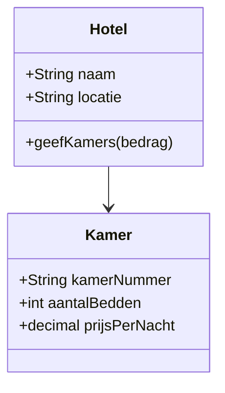
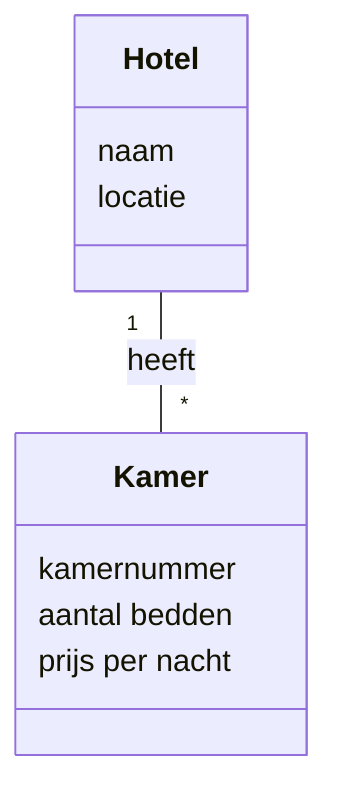

---
title:
  - Het klassendiagram
tags: []
difficulty: 2
taxonomie:
  - oo-15.1.Klassendiagram.OI
  - oo-15.2.Klassendiagram.OI
---

## Wat is een klassendiagram

Het klassendiagram is een ontwerptechniek voor het modelleren van de zogenaamde `structuur` van een softwaresysteem. Het bevat informatie over de `eigenschappen`(attributen) en het `gedrag` (methoden) van de klassen in het systeem. Ook bevat het diagram informatie over de relaties tussen de diverse klassen. 

Onderstaand diagram is een voorbeeld van een klassendiagram. Hierin zie je de structuur van een eenvoudige hotel softwaresysteem. 

*Diagram 1: een eenvoudig voorbeeld van een klassendiagram*

## Hoe zit het klassendiagram in elkaar

Klassendiagrammen kun je tegenkomen in een `functioneel ontwerp` en in een `technisch ontwerp`. In een functioneel ontwerp komt geen techniek voor. Je opdrachtgever of eindgebruiker zal een klassendiagram dat in een functioneel ontwerp is opgenomen kunnen begrijpen. Het beschrijft het domein waarvoor we een applicatie gaan maken. We noemen een dergelijk klassendiagram dan ook een `domeinmodel`.

Door het opstellen van een domeinmodel krijg je inzicht in het domein (b.v. een hotelketen) waarvoor je het systeem gaat ontwikkelen.

Door het opstellen van een technisch klassendiagram krijg je inzicht in de structuur van je applicatie. Dit gaat zowel over het domein als over de technische werking.

`Diagram 1` was een voorbeeld van een technisch klassendiagram. Hieronder vind je een voorbeeld van het bijbehorende domeinmodel.

*Diagram 2: een eenvoudig voorbeeld van een klassendiagram. In dit geval een domeinmodel. *

## Hoe gebruik je het klassendiagram

