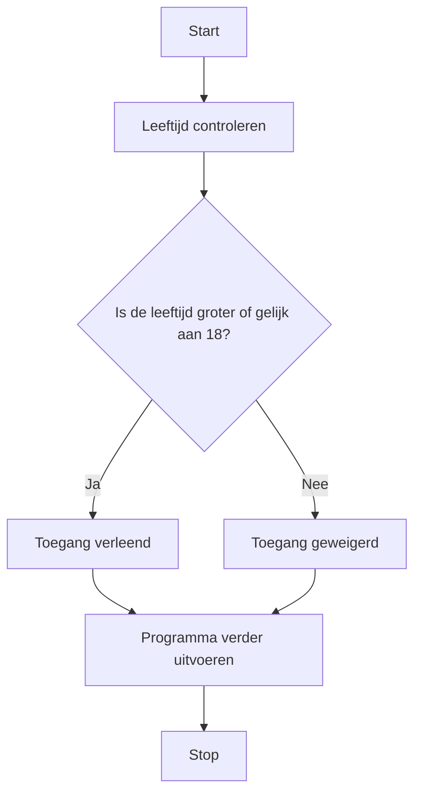

## Wat is een If-Else-structuur?
In de programmeerwereld worden If-Else-structuren gebruikt om beslissingen te nemen. Afhankelijk van de gegeven voorwaarden/conditie (bijv. leeftijd van de gebruiker), voert het programma één van de twee (of meer) mogelijke acties uit.

Zonder If-Else-structuren zouden programma's altijd dezelfde acties uitvoeren, ongeacht de omstandigheden. Met de If-Else-structuur kan een programma zich aanpassen en beslissingen nemen op basis van variabele waarden en voorwaarden.

> [!TIP] Casus
> Stel je hebt een evenement met toegangspoortjes georganiseerd. Als je een geldig kaartje hebt, mag je naar binnen; zo niet, dan blijf je buiten.

## Hoe zit een If-Else-structuur in elkaar?
De *If-Else*-structuur volgt een specifieke opbouw, die begint met een `if`-clausule waarin een conditie wordt gespecificeerd, gevolgd door de bijbehorende actie. Optioneel volgt daarna een `else`-clausule waarin een alternatieve actie kan worden gedefinieerd. Een conditie is een voorwaarde waaraan iets als een variabel kan voldoen.

Belangrijk om te weten is dat zodra de `if`-clausule waar is, de `else` niet wordt uitgevoerd. 

### Codevoorbeeld
```C#
if (conditie_1){
    // code om uit te voeren als de conditie waar is.
}
else{
    // alternatieve code als de conditie niet waar is.
}
```

Als in het bovenstaande voorbeeld `conditie_1` waar is, dan wordt de code tussen de eerste `{}`  uitgevoerd. 
Als de conditie `conditie_1` niet waar is, dan wordt de code tussen de `{}` van de `else` uitgevoerd.

## Hoe gebruik je een If-Else-structuur?
De causaliteit in een *If-Else*-structuur komt voort uit de vraag: "Wat gebeurt er als een conditie al dan niet waar is?" Het gebruik van *If-Else* stelt het programma in staat om gedrag te vertonen op basis van bepaalde omstandigheden, wat leidt tot verschillende uitkomsten. Bijvoorbeeld, als de gebruiker ouder is dan 18, krijgt hij/zij toegang, anders wordt de toegang geweigerd.

> [!TIP] Casus
> Stel je schrijft een script dat gebruikersleeftijd controleert. Op basis van de leeftijd geeft het script wel of geen toegang.
> - Als de leeftijd onder de 18 is mag er **geen** toegang worden verleend.
> - Als de leeftijd 18 of hoger is mag er **wel** toegang worden verleend.

**Mogelijke uitwerking van de casus**
```C#
int age = 16;

if (age >= 18) {
    Console.WriteLine("Toegang verleend");
}
else {
    Console.WriteLine("Toegang geweigerd");
}
```

**Een flowchart van de bovenstaande if-else structuur**


---

> Volgende stap: [[2. If-Else-If|If-Else-If]]
