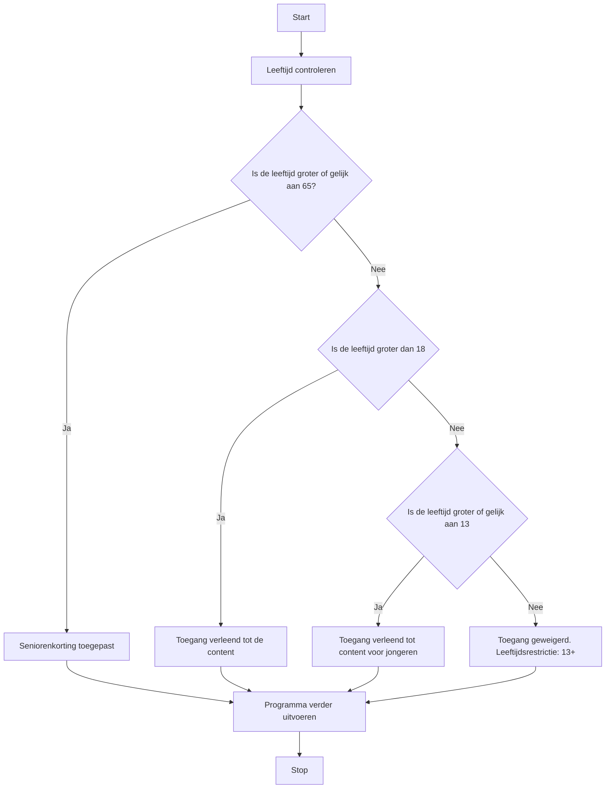

## Wat is een If-Else-If-structuur?
Soms moet je een programma maken waarin je meerdere condities wilt controleren. Bijvoorbeeld: als je een leeftijd controle wilt doen, maar ook wilt checken of iemand een speciale status heeft, zoals student of senior. Hierbij gebruik je de *If-Else-If*-structuur.

Een *If-Else-If*-structuur laat toe om meerdere condities achtereenvolgens te controleren en, afhankelijk van de eerste conditie die waar is, een actie uit te voeren.

## Hoe zit een If-Else-If-structuur in elkaar?
De *If-Else*-structuur werkt volgens een specifieke volgorde. Het begint met een `if`-clausule waarin een voorwaarde wordt gecontroleerd en, indien waar, de bijbehorende code wordt uitgevoerd.  Na de eerste `if`-clausule kan er optioneel een `else if`-clausule volgen, waarin een tweede voorwaarde wordt gecontroleerd. Als deze waar is, wordt de bijbehorende code uitgevoerd. Het voordeel van deze structuur is dat je zoveel `else if`-clausules kunt toevoegen als je wilt. Tot slot kan de hele structuur worden afgesloten met een `else`, die alleen wordt uitgevoerd als geen van de andere voorwaarden waar is.

Belangrijk om te weten is dat zodra een van de voorwaarden waar is, de overige voorwaarden niet meer worden gecontroleerd. Deze worden dus overgeslagen.

### Codevoorbeeld
```C#
if (conditie_1){
    // code om uit te voeren als de eerste conditie waar is.
}
else if (conditie_2){
    // code als de tweede conditie waar is.
}
else {
    // alternatieve code als geen enkele conditie waar is.
}
```

## Hoe gebruik je een If-Else-If-structuur?
In een *If-Else-If*-structuur bepaalt de volgorde van condities wat er gebeurt als meerdere voorwaarden wel of niet worden vervuld. Met If-Else-If kan een programma verschillende acties uitvoeren afhankelijk van de situatie, wat resulteert in diverse uitkomsten. 

> [!TIP] Casus
> - Voor gebruikers van 65 jaar en ouder wordt de boodschap "Seniorenkorting toegepast" weergegeven.
> - Gebruikers tussen 18 en 65 jaar krijgen de melding "Toegang verleend tot de content."
> - Gebruikers tussen de 13 en 18 jaar ontvangen een beperkte toegang.
> - Voor gebruikers jonger dan 13 jaar wordt de toegang geweigerd.

**Mogelijke uitwerking van de casus**
```C#
int age = 16;

if (age >= 65) {
    Console.WriteLine("Senioren korting toegepast.");
}
else if (age > 18) {
    Console.WriteLine("Toegang verleend tot de content.");
}
else if (age >= 13) {
    Console.WriteLine("Toegang verleend tot content voor jongeren.");
}
else {
    Console.WriteLine("Toegang geweigerd. Leeftijdsrestrictie: 13+");
}
```

In deze uitwerking wordt eerst met het meest restrictieve geval begonnen, waarna deze *grens* verder wordt uitgebreid. Hierdoor is het verloop in jaren mooi weergegeven.

**Een flowchart van de bovenstaande If-Else-If structuur**


---

> Volgende stap: [[3. If-Else-Logical-Operators|3. If-Else-Logical-Operators]]
