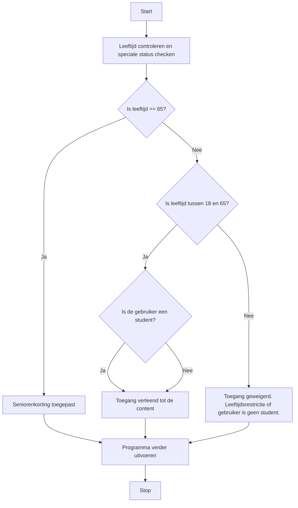
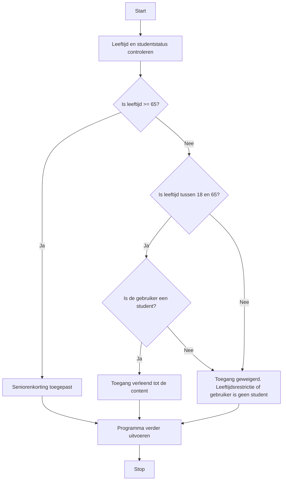

## Wat zijn logische operatoren in If-Else-structuren?
Logische operatoren zoals `&&` (en) en `||` (of) worden gebruikt om meerdere condities te combineren. Met deze operatoren kan het programma meerdere criteria tegelijk evalueren.
- `&&` (en): Deze operator zorgt ervoor dat beide condities waar moeten zijn voordat de code wordt uitgevoerd.
- `||` (of): Deze operator voert de code uit als ten minste één van de condities waar is.

Haakjes `()` worden gebruikt om voorwaarden in te sluiten en geven de volgorde van evaluatie duidelijk aan.

> [!TIP] CASUS
> Stel je hebt een evenement met toegangspoortjes georganiseerd.  Als de deuren open zijn en je hebt een geldig kaartje mag je naar binnen; zo niet, dan blijf je buiten.

## Hoe werken de haakjes en logische operatoren?
In een if-statement helpen haakjes `()` om complexe logica op te splitsen en te specificeren welke delen eerst worden geëvalueerd. Dit helpt om te bepalen of bepaalde delen van een voorwaarde aan elkaar gekoppeld zijn.

### Codevoorbeeld
```C#
if ((leeftijd > 18 && leeftijd < 65) || specialeStatus){
    // Code voor toegang indien tussen 18 en 65 jaar, of een speciale status
} else {
    // Alternatieve code als de condities niet waar zijn
}
```

## Hoe gebruik je logische operatoren in een If-Else-structuur?
Logische operatoren maken het mogelijk om specifieke scenario's te controleren waarin meerdere voorwaarden tegelijk relevant zijn. Dit is handig voor programma's die verschillende niveaus van toegang of rechten verlenen.

> [!TIP] Casus
> - Gebruikers van 18 tot 65 jaar, of met een speciale status zoals "student," krijgen toegang.
> - Gebruikers ouder dan 65 ontvangen de melding "Seniorenkorting toegepast."
> - Gebruikers onder 18 zonder speciale status krijgen geen toegang.

**Mogelijke uitwerking van de casus**
```C#
int age = 20;
bool isStudent = true;

if (age >= 65) {
    Console.WriteLine("Seniorenkorting toegepast.");
}
else if ((age >= 18 && age < 65) || isStudent) {
    Console.WriteLine("Toegang verleend tot de content.");
}
else {
    Console.WriteLine("Toegang geweigerd. Leeftijdsrestrictie of geen speciale status.");
}
```

**Flowchart van de bovenstaande If-Else-If structuur**


In deze flowchart kan je zien dat zodra de leeftijd tussen de 18 en 65 ligt het niet meer uitmaakt of de gebruiker een student is of niet. Dit komt door de `||` (of). 
Was de `||` vervangen door `&&` had de flowchart als volgt eruit gezien:



In deze flowchart kan je dus zien dat het tweede deel, `isStudent` nu wel van belang is. 

---

> Volgende stap: [[content/3. Procedurele-informatie/3. Processen/4. Implementatieproces/2. Bouwen softwaresysteem/1. If-Else|Procedurele informatie]]
