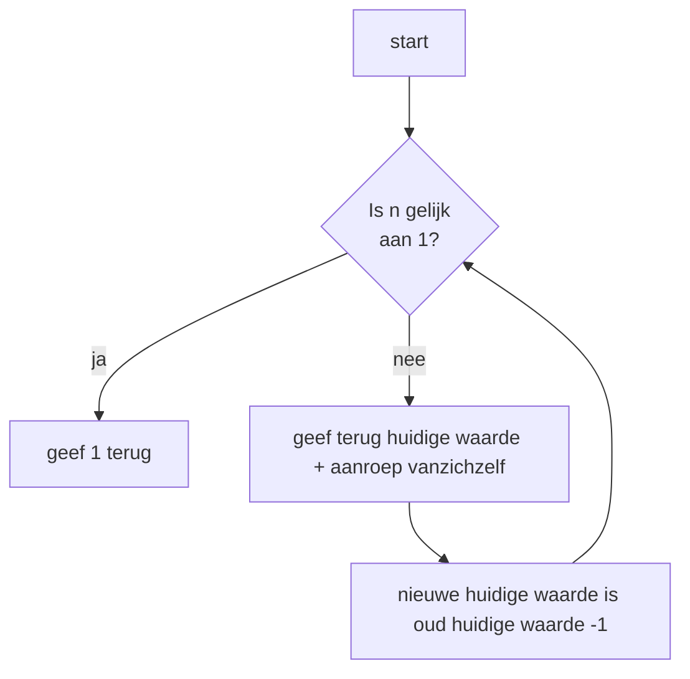

## Wat is een Recursie?
Een recursieve functie is een in de basis functie die zichzelf aanroept en dit blijft herhalen tot er voldoet aan een bepaalde conditie.

> [!TIP] Casus
> Stel je wilt een papiertje dubbel blijven vouwen tot dat het niet meer kan, dit uitvoeren is een recursieve actie.

## Hoe zit Recursie in elkaar?
Om een recursieve functie te laten werken moet het voldoen aan de volgende eigenschappen:
1. Een recursieve functie roept zichzelf aan.
2. Een recursieve functie is eindig.
3. Een recursieve functie maakt het probleem kleiner.

Zoals in punt 1 wordt beschreven, moet de functie zichzelf aanroepen. Dit vormt de basis van recursiviteit en zorgt voor de herhaling binnen de functie.

Punt 2 verwijst naar het concept van de 'base case', de voorwaarde die bepaalt wanneer de recursie stopt. Deze eindconditie wordt doorgaans geïmplementeerd met behulp van [[4. Deeltaken/3. Processen/4. Implementatieproces/2. Bouwen softwaresysteem/If-Else/1. If-Else|If-Else]]-logica.

Punt 3 benadrukt het belang van voortgang binnen de recursie. Dit kan op verschillende manieren worden bereikt, bijvoorbeeld door een variabele die aftelt of door een datastructuur te doorlopen. Het is echter essentieel dat de functie stapsgewijs naar de base case toewerkt.
### Codevoorbeeld
```C#
public void recursieveFunctie(int aantal)
{
	if(aantal >= 1)
	// base case om te controleren of de functie weer aangeroepen met worden
	{
		recursieveFunctie(aantal - 1)
		// hier wordt de functie aangeroepen en wordt het probleem kleiner gemaakt
	}
}
```

Als de functie in het bovenstaande voorbeeld wordt aangeroepen met de waarde 5, dan zal deze functie 5 keer uitgevoerd worden. Doordat bij de recursieve aanroep de waarde verlaagt wordt met 1. Hier is `if(aantal >= 1)` is de base case, aangezien deze er voor zorgt dat er een einde aan de recursie is.

## Hoe gebruik je Recursie?
Het gebruik van recursie vertoont overeenkomsten met iteratieve herhalingsstructuren, zoals de [[|For-]] en [[|While-loop]]. Het belangrijkste verschil is dat recursie vaak een elegantere en meer compacte oplossing kan bieden dan een iteratieve aanpak.

Een nadeel van recursieve oplossingen is echter dat ze doorgaans intensiever kunnen zijn in termen van rekencapaciteit en geheugen. Dit is met name het geval wanneer de methode bij elke recursieve stap meerdere keren moet worden aangeroepen. In dergelijke situaties kan het aantal uitvoeringen exponentieel toenemen, wat leidt tot een aanzienlijke belasting van het systeem.

> [!TIP] Casus
>Stel je wilt een functie schrijven die de som van alle getallen van 1 tot en met een gegeven getal `n` berekend
>* De functie moet recursief zijn.
>* De input is altijd positief.

**Mogelijke uitwerking van de casus**
```C#
public int SomTotN(int n)
{
	if(n == 1) return 1;
	else return n + SomTotN(n-1);
}
```

**De flowchart van de bovenstaande recursieve functie**


---

> Volgende stap: [[3. Procedurele-informatie/3. Processen/4. Implementatieproces/2. Bouwen softwaresysteem/Recursie/1. Recursie|1. Recursie]]
