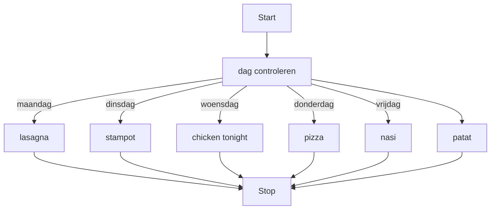

## Wat is een Switch-Case-structuur?
De switch-case is een code structuur die verschillende actie kan uitvoeren op basis van de waarde van een variabel.

Zonder een switch-case-structuur zou je voor elk mogelijk scenario een aparte if-else-structuur moeten schrijven, wat het programma complex en onoverzichtelijk maakt. De switch-case-structuur laat het programma beslissingen nemen op een georganiseerde manier, waarbij elke mogelijke waarde (case) een specifieke actie uit kan voeren.


> [!TIP] Casus
> Stel dat je een programma hebt waarin op basis van de dag van de week, het avondeten wordt bepaalt. Met een switch-case kun je gemakkelijk een actie uitvoeren afhankelijk van de dag.

## Hoe zit een Switch-Case-structuur in elkaar?
De *switch-case*-structuur volgt een specifieke opbouw, die begint met een `switch`-clausule waarin een variabele of statement wordt gespecificeerd. In de `switch` komen `cases` te staan voor alle waardes waar je het variabel aan wilt testen. In een `case` kan je code uitvoeren. Om een `case` af te sluiten word het `break`-clausule gebruikt die hetzelfde werkt als de standaard break. 

Optioneel zit er in een `switch` ook een enkele `default`-clausule waarvan de actie uitgevoerd wordt als alle eerdere `cases` niet uitgevoerd werden.

### Codevoorbeeld
```C#
switch(variabel_1){
	case "variabelStatus1" :
	    // code om uit te voeren als de case waar is.
	    break;
	case "variabelStatus2" :
	    // code om uit te voeren als de case waar is.
		break;
	default :
		// code om uit te voeren als variabel_1 niet de waarde van de cases bevat.
}
```

Als in het bovenstaande voorbeeld de waarde van `variabel1` "variabelStatus1" is, dan wordt de code van de eerste `case` uitgevoerd. 
Als de waarde van `variabel1`  "variabelStatus2" is, dan wordt de code van de tweede `case` uitgevoerd. 
Als de waarde van `variabel1` niet "variabelStatus1" en niet "variabelStatus2" is, dan word de `default` uitgevoerd.

## Hoe gebruik je een If-Else-structuur?
Een switch-case is handig wanneer er bij verschillende waardes van een variabel verschillende acties uitgevoerd moeten worden. Switch cases kunnen naast specifieke waardes ook gebruikt worden voor bijvoorbeeld een getallen range. hier zou een case uitgevoerd kunnen worden als het getal bijvoorbeeld tussen de 5 en de 10 zit. Bekijk hiervoor de [[3. If-Else-Logical-Operators|If-else-operatoren]].


> [!TIP] Casus
> Stel je schrijft een programma wat er op welke dag van de week word gegeten. Op maandag lasagna, op dinsdag stampot, op woensdag chicken tonight, op donderdag pizza, op vrijdag nasi en in het weekend beide dagen patat.

**Mogelijke uitwerking van de casus**
```C#
string dag = "maandag";
string gerecht;

switch(dag)
{
case "maandag":
	gerecht = "lasagna";
	break;
case "dinsdag":
	gerecht = "stampot";
	break;
case "woensdag":
	gerecht = "chicken tonight";
	break;
case "donderdag":
	gerecht = "pizza";
	break;
case "vrijdag":
	gerecht = "nasi";
	break;
default:
	gerecht = "patat";
	break;
}
```

In de bovenstaande switch-case wordt bepaalt wat het gerecht is aan de hand van de waarde van het variabel `dag`. Wanneer de dag niet maandag, dinsdag, woensdag, donderdag of vrijdag is, wordt de default case uitgevoerd.

**Een flowchart van de bovenstaande switch-case-structuur**


---

> Volgende stap: [[content/3. Procedurele-informatie/3. Processen/4. Implementatieproces/2. Bouwen softwaresysteem/Switch/1. Switch|Proceduele Informatie]]
