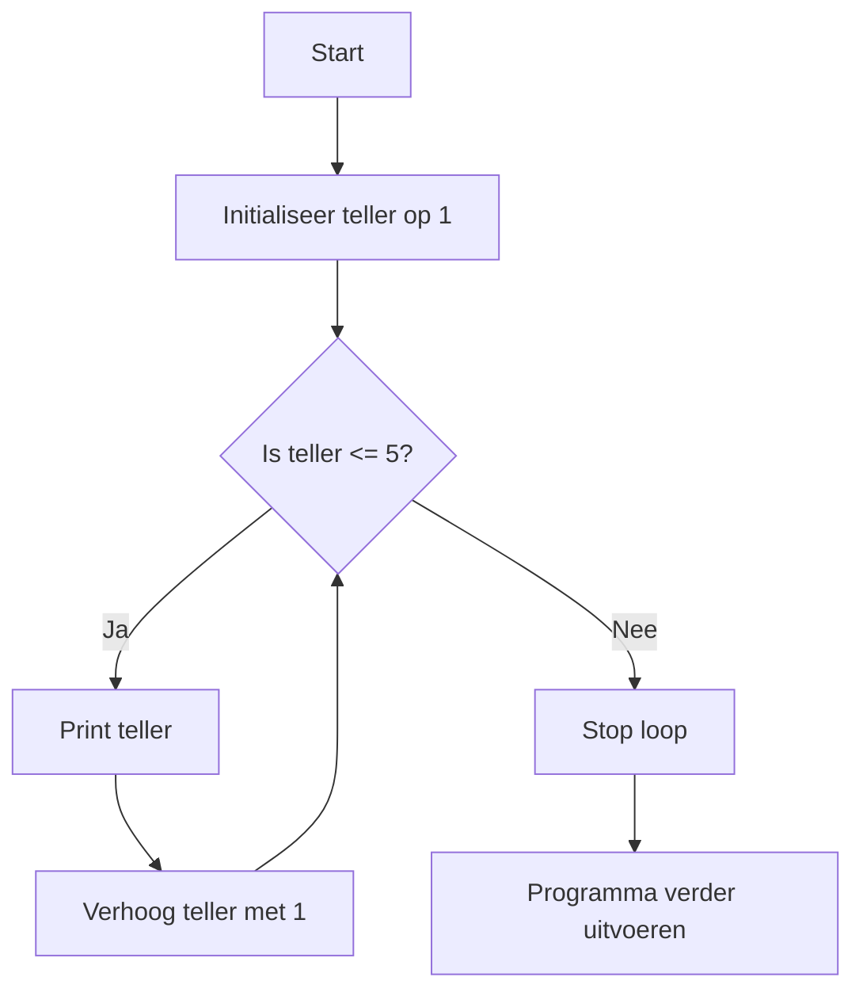

## Wat is een While-loop?
In de programmeerwereld worden **While-loops** gebruikt om een bepaald stukje code herhaaldelijk uit te voeren zolang aan een voorwaarde wordt voldaan. Dit maakt het mogelijk om dynamische herhalingen te creëren, waarbij je vooraf niet weet hoe vaak de loop zal draaien. De herhaling stopt zodra de voorwaarde **onwaar** (false) wordt.

Zonder while-loops zou je telkens dezelfde code handmatig moeten herhalen, wat onpraktisch en foutgevoelig is. Met een while-loop kan een programma zichzelf herhalen en aanpassen op basis van variabele waarden en voorwaarden.

> [!TIP] Casus
> Stel je telt tot 5. Je begint bij 1 en blijft tellen totdat je bij 5 komt. Zodra je bij 5 bent, stop je met tellen.

## Hoe zit een While-loop in elkaar?
De while-loop volgt een specifieke opbouw die begint met een while-clausule waarin een conditie wordt gespecificeerd. Zolang deze conditie waar (`true`) is, wordt de code binnen de lus herhaaldelijk uitgevoerd. Zodra de conditie onwaar (`false`) wordt, stopt de herhaling en gaat het programma verder.

Een conditie is een voorwaarde waaraan iets, zoals een variabele, kan voldoen.

### Codevoorbeeld
```C#
while(conditie){
	// code om uit te voeren zolang de conditie waar is
}
```

In het bovenstaande voorbeeld wordt de code binnen de {} steeds uitgevoerd zolang de conditie waar (`true`) is. Zodra de conditie onwaar wordt, stopt de while-loop en gaat het programma verder met de rest van de code.

## Hoe gebruik je een While loop?
Het gebruik van een **while-loop** komt voort uit de behoefte om een actie herhaaldelijk uit te voeren totdat een specifieke voorwaarde **niet meer waar** is. Dit maakt een programma flexibel en geschikt voor iteratieve taken, zoals tellen, verwerken van gegevens, of wachten op invoer van een gebruiker. De herhaling stopt wanneer de conditie **onwaar** wordt, waarna het programma verder gaat met de volgende stappen.

> [!TIP] Casus
Stel je wilt een programma schrijven dat telt van 1 tot 5. Zolang het huidige getal kleiner dan of gelijk aan 5 is, wordt het getal weergegeven. Zodra het getal groter dan 5 is, stopt de loop.

**Mogelijke uitwerking van de casus**
```C#
int teller = 1;

while (teller <= 5) {
    Console.WriteLine(teller);  // Print het huidige getal
    teller++;  // Verhoog het getal met 1
}
```

**Een flowchart van de bovenstaande while-loop**



---

> Volgende stap: [[content/3. Procedurele-informatie/3. Processen/4. Implementatieproces/2. Bouwen softwaresysteem/While/1. While|Procedurele informatie]]