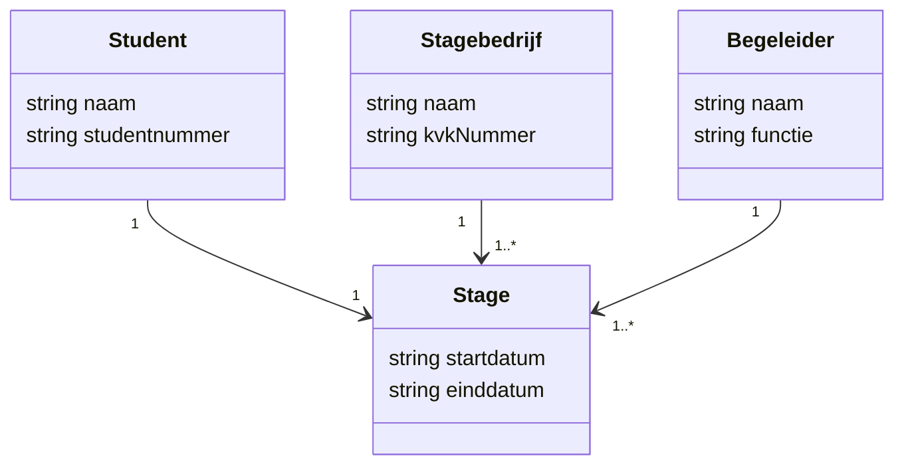

## Wat is het definiëren van het probleemdomein?
Het **definiëren van het probleemdomein** is de eerste stap binnen het requirementsanalyseproces. In deze stap wordt onderzocht in welke context het systeem opereert, wat het probleem is dat opgelost moet worden en welke concepten daarin een rol spelen. Dit vormt de basis voor alle vervolgstappen.

Het doel is om gezamenlijk met de opdrachtgever en andere belanghebbenden te begrijpen:
- Wat het probleem is;
- Waarom het een probleem is;
- Welke begrippen en relaties binnen dat probleem een rol spelen.

Er zijn twee kernactiviteiten in deze stap:
1. **Bestuderen van de probleemstelling**
2. **Maken van een domeinmodel**

> [!TIP] Casus
> Een onderwijsinstelling wil overstappen op een digitaal voortgangsvolgsysteem voor stages. Studenten, begeleiders en stagebedrijven moeten hiermee kunnen werken. Het huidige proces is versnipperd en onoverzichtelijk. 
> Door gesprekken met betrokkenen te voeren en een domeinmodel op te stellen, wordt duidelijk hoe termen als “stagebedrijf”, “stageverslag”, “begeleider” en “stageperiode” zich tot elkaar verhouden en waar het probleem zit in communicatie en zichtbaarheid van de voortgang.

## Hoe zit het definiëren van het probleemdomein in elkaar?
Om het probleemdomein goed te begrijpen, moet je zowel het probleem als de context waarin het zich voordoet grondig analyseren. Dit doe je door het probleem vanuit verschillende invalshoeken te benaderen: inhoudelijk, organisatorisch en visueel. Binnen deze stap voer je twee hoofdactiviteiten uit die elkaar aanvullen: **bestuderen van de probleemstelling** en **maken van een domeinmodel**.

### Bestuderen probleemstelling
**Bestuderen van de probleemstelling** is het systematisch in kaart brengen van het probleem dat de aanleiding vormt voor de ontwikkeling van een (software)systeem. Het doel is om het probleem te begrijpen vanuit het perspectief van de opdrachtgever én de gebruikers. Daarbij gaat het niet alleen om **wat** het probleem is, maar ook **waarom** het een probleem is en **voor wie**.

Deze activiteit vormt de basis voor alle vervolgstappen in het requirementsproces: je kunt pas goede oplossingen bedenken als je het probleem goed begrijpt. Door het **bestuderen van de probleemstelling** ontwikkel je een gedeeld begrip tussen ontwikkelteam en opdrachtgever, en voorkom je dat je straks een systeem oplevert dat niet aansluit bij de werkelijke behoefte.

**Waarom gebruik je het?**
- Om verwarring, aannames en ruis in communicatie met de opdrachtgever te voorkomen
- Om vanuit een objectieve analyse te kunnen bepalen wat er precies misgaat en waarom
- Om te zorgen dat je oplossing straks echt waarde toevoegt
- Om een duidelijke context te hebben voor het verzamelen van requirements en het ontwerpen van het systeem

**Hoe pak je het definiëren van het probleemdomein aan?**
Tijdens het **bestuderen van de probleemstelling** verzamel je informatie vanuit verschillende invalshoeken:
- **Interviews met gebruikers en stakeholders:** Hiermee achterhaal je knelpunten, wensen, frustraties en doelen. Dit helpt je om het probleem niet alleen technisch, maar ook mensgericht te begrijpen.
- **Analyse van bestaande processen of systemen:** Door bestaande documenten, software of werkprocessen te analyseren, ontdek je hoe het nu gaat en waar het vastloopt. Dit geeft inzicht in de context en eventuele beperkingen.
- **Opstellen van een visiedocument of contextbeschrijving:** In deze documenten leg je de kern van het probleem vast, inclusief de aanleiding, betrokken partijen, impact en gewenste situatie. Het helpt om dit op een visuele manier te doen, bijvoorbeeld met een contextdiagram of stakeholderanalyse.

> [!TIP] Casus – voortgezet
> Stel: een school wil overstappen op een digitaal absentiesysteem. Door interviews met docenten en administratief personeel blijkt dat het huidige papieren systeem traag, foutgevoelig en slecht traceerbaar is. Ook blijkt dat ouders te laat worden geïnformeerd. Op basis van deze inzichten formuleer je het kernprobleem: *"Er is onvoldoende zicht op en communicatie over de aanwezigheid van leerlingen, wat leidt tot vertraging in de opvolging door ouders en schoolleiding."*
> Je beschrijft vervolgens de context, betrokken actoren (leerling, docent, administratie, ouder), en je maakt bijvoorbeeld een contextdiagram waarin de huidige informatiestroom visueel wordt weergegeven. Dit vormt de basis voor het verzamelen van concrete requirements.

### Maken domeinmodel
Een **domeinmodel** is een grafische representatie van de belangrijkste begrippen in het domein en hun onderlinge relaties. Dit gebeurt meestal met een UML-klassendiagram. Denk hierbij aan entiteiten zoals “Student”, “Begeleider”, “Stagebedrijf” en hun verbanden (bijv. “Student loopt stage bij Stagebedrijf”).

Een goed domeinmodel:
- Richt zich op de concepten uit het probleemgebied (dus nog geen technische implementatie!)
- Is begrijpelijk voor zowel ontwikkelaars als niet-technische stakeholders
- Wordt ondersteund door een korte toelichting

### Voorbeeld UML klassendiagram (domeinmodel)

## Hoe gebruik je het definiëren van het probleemdomein?
Het **definiëren van het probleemdomein** is geen standaard checklist die je simpelweg afwerkt. Het is een strategische activiteit waarbij je keuzes maakt over wat je wél onderzoekt, en wat niet. Dit hangt af van de complexiteit van het domein, het type opdrachtgever, de beschikbare tijd en het beoogde resultaat van de analyse.

Je gebruikt deze activiteit strategisch als fundament voor het hele ontwerp- en ontwikkelproces. In plaats van alleen te registreren *wat* het probleem is, probeer je vooral te doorgronden *waarom* het probleem bestaat, en *wat de impact is* als het niet opgelost wordt. Dat helpt je later om ontwerpkeuzes te onderbouwen en prioriteiten te stellen.

### Belangrijke strategische keuzes:
- **Bepaal de focus**: Richt je op het deel van het domein waar het meeste knelt. Ga niet alles modelleren, maar kies doelgericht een probleemgebied dat essentieel is voor het succes van de oplossing.
- **Kies de juiste bronnen en stakeholders**
- **Kies het juiste abstractieniveau**
- **Kies het juiste moment**
- **Maak het herbruikbaar**

### SCRUM
In **SCRUM** vindt het definiëren van het probleemdomein meestal plaats vóór of tijdens de eerste sprint(s), vaak in de vorm van een **Sprint 0** of voorbereidingsfase. In deze fase wordt de productvisie verkend, de belangrijkste stakeholders worden gesproken en de context van het probleem wordt vastgesteld. Hoewel SCRUM documentatie niet verplicht stelt, is het vastleggen van het probleemdomein – bijvoorbeeld met een domeinmodel of contextschets – van grote waarde voor het development team. Tijdens latere sprints kan dit domein verder verfijnd worden, bijvoorbeeld als er nieuwe inzichten ontstaan of als backlogitems beter begrepen moeten worden.

### SSDLC
Binnen de **Secure Software Development Life Cycle (SSDLC)** wordt het definiëren van het probleemdomein voornamelijk uitgevoerd in de **Initiate**- of **Plan**-fase van het proces. In deze fasen ligt de focus op het begrijpen van de businesscontext, het in kaart brengen van risico’s en het definiëren van de scope. Hierbij hoort ook een analyse van het probleemdomein, waarin technische én niet-technische risico’s geïdentificeerd worden. Denk aan datakritische processen, gevoelige informatie of kwetsbare interacties met externe systemen. In tegenstelling tot SCRUM, wordt binnen SSDLC vaak gestructureerder gedocumenteerd.

**Alternatieven/aanvullingen:**
- C4-context diagrammen als alternatief voor tekstuele context
- BPMN of swimlane-diagrammen bij procesgericht probleem

> [!INFO] Tip 
> - Stel verhelderende vragen
> - Gebruik visuele modellen
> - Toets je interpretatie
> - Houd de scope beperkt

---

> Volgende stap: [[2. Uitleg verzamelen requirements|Uitleg verzamelen requirements]]