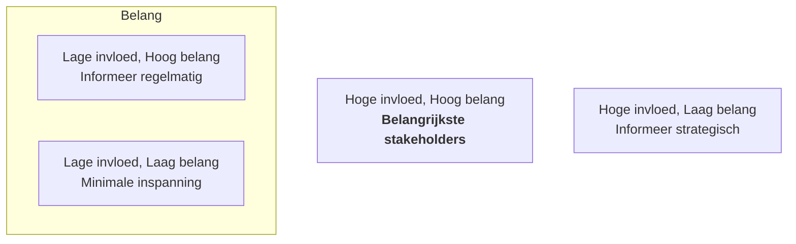

## Wat is beschrijven van stakeholders?
**Beschrijven van stakeholders** is het proces waarin je vaststelt wie belanghebbenden zijn bij een systeem of project, wat hun rol is, en welk belang zij hebben bij de ontwikkeling van het systeem. Stakeholders kunnen mensen of groepen zijn binnen of buiten de organisatie die invloed uitoefenen op of worden beïnvloed door het systeem. Deze beschrijving vormt de basis voor het effectief ophalen van requirements.

> [!TIP] Casus
> Stel je voor: je ontwikkelt een reserveringssysteem voor een sportcentrum. Mogelijke stakeholders zijn:
> - De manager, die inzicht wil in het gebruik van zalen.
> - De receptiemedewerker, die reserveringen beheert.
> - De sporters, die online willen boeken.
> - De IT-afdeling, die het systeem moet onderhouden.
> Elk van deze stakeholders heeft andere belangen, die je vooraf duidelijk in kaart brengt.

## Hoe zit beschrijven van stakeholders in elkaar?

**Beschrijven van stakeholders** gebeurt meestal in vier stappen:

1. **Identificeren van stakeholders:** Door interviews, documentanalyse of brainstormsessies breng je in kaart wie invloed heeft op of beïnvloed wordt door het systeem.
2. **Vastleggen van rol en belang:** Per stakeholder beschrijf je wat hun rol is (bijv. gebruiker, beheerder, opdrachtgever) en welk belang ze hebben bij het systeem (bijv. efficiëntie, controle, gebruiksgemak).
3. **Analyseren van invloed en betrokkenheid:** Je maakt een inschatting van hoeveel invloed de stakeholder heeft op beslissingen en hoe groot zijn of haar belang is.
4. **Weergeven in een stakeholdersanalyse (Grid van Mendelow):** Hiermee categoriseer je stakeholders op twee assen: invloed en belang. Het resultaat is een overzichtelijk schema dat helpt bij het bepalen van je communicatiestrategie.

### Voorbeeld: Grid van Mendelow

| Stakeholder           | Rol               | Belang                   | Invloed | Positie in Grid     |
|----------------------|-------------------|--------------------------|---------|---------------------|
| Manager              | Opdrachtgever     | Inzicht in zaalgebruik   | Hoog    | A                   |
| Receptiemedewerker   | Dagelijks gebruiker| Efficiënt reserveren     | Laag    | C                   |
| Sporter              | Eindgebruiker     | Gebruiksgemak            | Laag    | C                   |
| IT-afdeling          | Beheerder         | Systeemonderhoud         | Hoog    | B                   |

## Hoe gebruik je beschrijven van stakeholders?

Je gebruikt **beschrijven van stakeholders** om gericht requirements te kunnen verzamelen. Door te begrijpen wie welke belangen heeft, kun je interviews en observaties beter voorbereiden, conflicterende belangen identificeren en prioriteiten stellen. Het helpt je ook om te bepalen met wie je wanneer en hoe communiceert tijdens het hele ontwikkeltraject.

**Je voert de beschrijving van stakeholders uit aan het begin van het requirementsanalyseproces**, direct nadat het probleemdomein is gedefinieerd. Dit vormt de basis voor de volgende stap: het uitvragen van requirements. Door stakeholders tijdig in kaart te brengen, voorkom je dat belangrijke belangen over het hoofd worden gezien of te laat in het proces worden meegenomen.

> [!TIP] Casus
> Je werkt aan een app voor studentenadministratie.
>
> **Eisen aan de beschrijving:**
> - Benoem alle betrokken partijen (studenten, administratie, docenten, ICT).
> - Geef per stakeholder hun invloed en belang aan.
> - Vul een Mendelow-grid in met de stakeholders.
> - Gebruik dit overzicht om te bepalen met wie je eerst in gesprek gaat.

---

> Volgende stap: [[1. Uitleg Uitvragen requirements|Uitleg Uitvragen requirements]]
