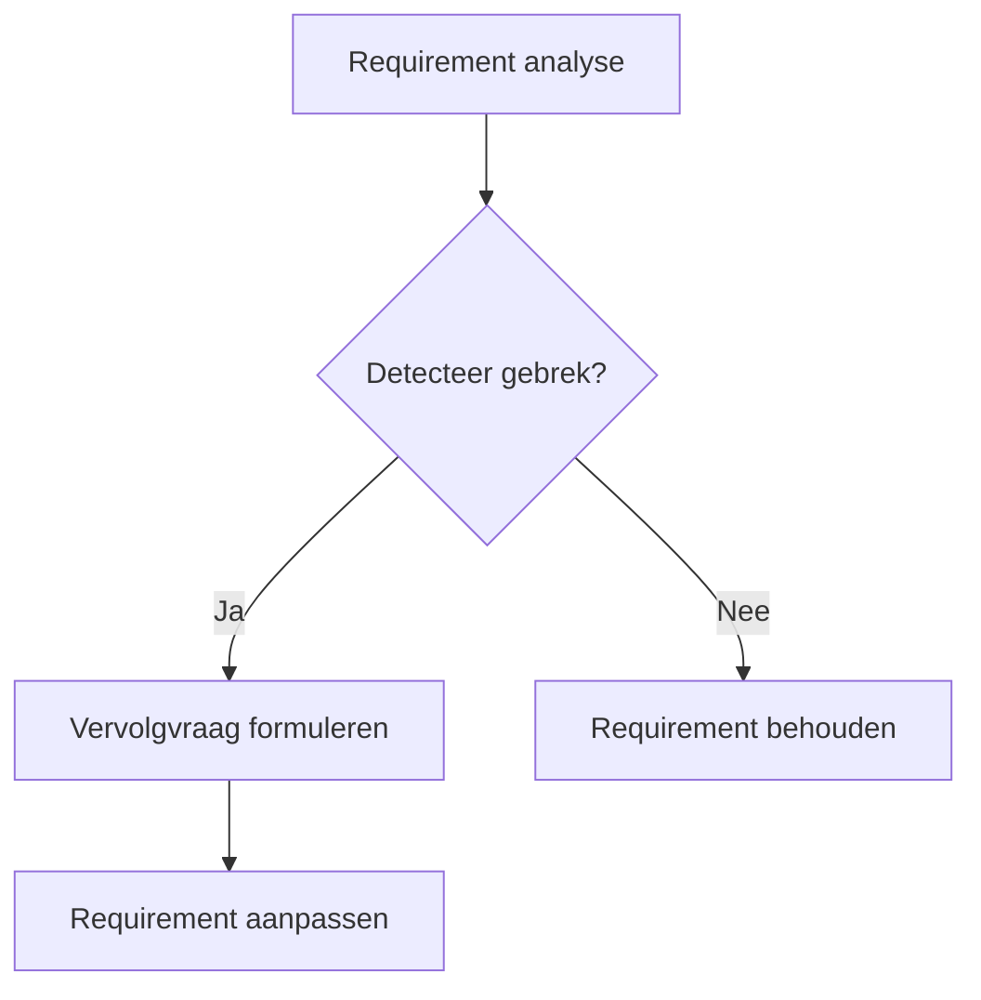

## Wat is het detecteren van mogelijke gebreken in requirements?
**Detecteren van mogelijke gebreken in requirements** houdt in dat je kritisch kijkt naar de opgestelde requirements om fouten, onduidelijkheden of tegenstrijdigheden op te sporen. Het doel hiervan is om tot een set van **eenduidige, objectieve en testbare** eisen te komen, zodat verwarring tijdens ontwerp en implementatie wordt voorkomen. 

### Veelvoorkomende gebreken  
- **Redundantie:** Een requirement wordt dubbel genoemd of overlapt met een andere.  
  > [!TIP] Casus  
  > Bij een app voor maaltijdbezorging vindt het team de volgende twee requirements terug:  
  > - "De gebruiker moet een bestelling kunnen annuleren."  
  > - "De gebruiker moet zijn bestelling annuleren indien gewenst."  
  >  
  > Beide requirements beschrijven dezelfde functionaliteit, maar in iets andere bewoordingen. Dit kan verwarring veroorzaken tijdens ontwerp of implementatie: moet er één annuleerfunctie zijn of meerdere?  
  > **Vervolgvraag:** *Kunnen deze twee eisen samengevoegd worden tot één eenduidige formulering?*

- **Tegenstrijdigheid:** Twee of meer requirements spreken elkaar tegen.  
  > [!TIP] Casus  
  > Tijdens het opstellen van requirements voor een reserveringssysteem valt het team op dat er twee requirements zijn:  
  > - "De gebruiker moet reserveringen kunnen annuleren."  
  > - "Een gemaakte reservering kan niet aangepast of geannuleerd worden."  
  >  
  > Hier is duidelijk sprake van een tegenstrijdigheid. Door deze vroegtijdig te detecteren, voorkomt het team discussie of herbouw tijdens de ontwikkelfase.  
  > **Vervolgvraag:** *In welke gevallen mag een reservering geannuleerd worden?*

- **Vage formuleringen:** Requirements zijn open voor meerdere interpretaties.  
  > [!TIP] Casus  
  > Voor een leerplatform staat de volgende requirement in het document:  
  > - "Het platform moet gebruiksvriendelijk zijn."  
  >  
  > Deze eis is te subjectief: wat is gebruiksvriendelijk? Voor een docent is dat misschien een snelle manier om toetsen te maken, voor een student juist duidelijk overzicht van deadlines.  
  > **Vervolgvraag:** *Voor wie moet het platform gebruiksvriendelijk zijn, en wat betekent dat concreet?*

- **Onvolledigheid:** Niet alle noodzakelijke informatie is aanwezig.  
  > [!TIP] Casus  
  > In een HR-systeem staat de requirement:  
  > - "De manager kan verlofaanvragen goedkeuren."  
  >  
  > Het is onduidelijk wat er gebeurt na goedkeuring: krijgt de medewerker een melding? Wordt dit ergens opgeslagen? Welke rol heeft HR hierbij?  
  > **Vervolgvraag:** *Wat moet er gebeuren nadat een aanvraag is goedgekeurd, en wie moet hiervan op de hoogte worden gebracht?*

## Hoe zit detecteren van gebreken in elkaar?
Het proces bestaat uit drie activiteiten:
1. **Identificeren van gebreken:**
   - Door systematisch requirements te lezen, kun je inconsistenties, vaagheden en dubbele formuleringen herkennen. Gebruik hierbij richtlijnen zoals SMART (Specifiek, Meetbaar, Acceptabel, Realistisch, Tijdsgebonden).
   - Analyseer de requirements op synoniemen, onduidelijke termen (zoals “gebruiksvriendelijk”) en onvolledige zinnen.

2. **Opstellen van vervolgvraag of actie:**
   - Stel per gedetecteerd gebrek gerichte vervolgvragen. Bijvoorbeeld:  
     - “Wat wordt bedoeld met ‘gebruiksvriendelijk’?”
     - “Waarom is dezelfde functionaliteit twee keer beschreven?”
     - “Onder welke voorwaarden geldt dit gedrag?”

3. **Documenteren en verbeteren:**
   - Noteer elk gevonden gebrek en de gestelde vragen in een analyse-overzicht.
   - Werk samen met stakeholders om onduidelijkheden te verhelderen en de requirements aan te scherpen.

## Hoe gebruik je detecteren van gebreken in requirements?

Je gebruikt **detecteren van gebreken in requirements** tijdens het reviewen van requirements (bijvoorbeeld uit een backlog, functioneel ontwerp of user story-overzicht). Dit gebeurt idealiter:
- In een vroeg stadium van het project.
- In samenwerking met domeinexperts en eindgebruikers.
- Voorafgaand aan ontwerp, zodat je een consistente input hebt voor modelleertechnieken zoals UML of user flows.

> [!TIP] Casus  
> Je bent betrokken bij een project voor een onderwijsplatform. In de lijst met requirements staat:  
> - “De applicatie moet snel zijn.”  
> - “De laadtijd mag maximaal 3 seconden bedragen.”  
>  
> Je stelt vast dat de eerste requirement te vaag is en dat de tweede al specifieker is. Je stelt als vervolgvraag: *“Kan de eerste requirement vervangen worden door de tweede, of moet ‘snel’ ook gelden voor andere functies dan pagina’s laden?”*
>
> **Mogelijke uitwerking van de casus**
>```text
>Requirement 1: “De applicatie moet snel zijn.” → Te vaag  
>Requirement 2: “De laadtijd van de hoofdpagina is max. 3 seconden.” → Specifiek  
>Actie: Eerste requirement verwijderen of verduidelijken in overleg met de klant.
>```



### SCRUM  
In **SCRUM** is het opsporen van gebreken in requirements een gezamenlijke verantwoordelijkheid van het team tijdens **refinement sessies** en de **Sprint Planning**.  
- Tijdens refinement worden user stories besproken, waarbij het team actief vragen stelt om onduidelijkheden en tegenstrijdigheden weg te nemen.  
- In de Definition of Ready (DoR) kunnen teams opnemen dat een user story **eenduidig**, **volledig** en **niet tegenstrijdig** moet zijn.

Door gebreken al vóór het begin van een sprint te detecteren, wordt de kans op technische schulden of incomplete functionaliteit verkleind.

### SSDLC  
Binnen de **Secure Software Development Life Cycle (SSDLC)** is het **detecteren van gebreken in requirements** essentieel tijdens de **requirements fase**.  
- Door vroegtijdig inconsistenties, tegenstrijdigheden en vage formuleringen op te sporen, kunnen beveiligingsrisico’s en functionele fouten worden voorkomen.  
- Vooral bij niet-functionele eisen zoals performance en veiligheid is scherpte vereist: wat betekent "veilig" of "snel" concreet?

De **SSDLC** is een **cyclisch proces**, waarbij het mogelijk is om in latere fasen terug te grijpen naar eerder opgestelde requirements.  
- Dit betekent dat het opsporen van gebreken niet alleen aan het begin plaatsvindt, maar ook tijdens ontwerp, implementatie en testen.  
- Wanneer bijvoorbeeld tijdens testen blijkt dat een requirement niet goed te verifiëren is, kan dit leiden tot een bijstelling of verduidelijking van de oorspronkelijke formulering.

**Detecteren van gebreken** is dus niet een eenmalige actie, maar een doorlopend aandachtspunt binnen de iteraties van de SSDLC. Zo blijft de kwaliteit van het systeem gewaarborgd en sluit het beter aan bij de veranderende inzichten of context.

---

> Volgende stap: [[2. Uitleg prioriteren requirements|Uitleg prioriteren requirements]]