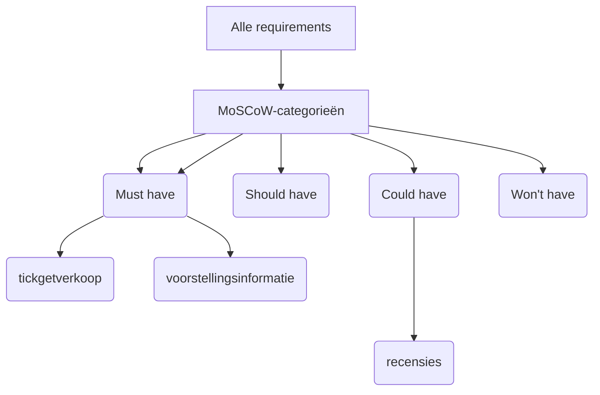

## Wat is prioriteren van requirements?
**Prioriteren van requirements** betekent dat je bepaalt welke eisen belangrijker zijn dan andere. Niet alle wensen en eisen kunnen tegelijk gerealiseerd worden. Daarom helpt prioritering om keuzes te maken die passen binnen de beschikbare middelen (tijd, geld, mensen). Door te prioriteren krijgt het ontwikkelteam focus, en weten stakeholders beter wat ze wanneer kunnen verwachten.

> [!TIP] Casus
> Stel: je ontwikkelt een app voor het plannen van sportactiviteiten binnen een studentenvereniging. In de eerste gesprekken worden allerlei wensen genoemd: integratie met WhatsApp, betaalopties, een dashboard voor trainers, agenda-integratie, enz. Je kunt niet alles tegelijk bouwen. Tijdens het analyseren van de requirements pas je **prioritering** toe. De agenda-integratie en het dashboard voor trainers zijn volgens de stakeholders het belangrijkst. Andere wensen worden als "later" aangemerkt.

## Hoe zit prioriteren van requirements in elkaar?
Een veelgebruikte methode om **prioriteren van requirements** uit te voeren is de **MoSCoW-analyse**. Deze verdeelt de requirements in vier categorieën:

- **Must have** – Eisen die absoluut noodzakelijk zijn voor een minimale werkbare versie van het systeem.
- **Should have** – Belangrijke eisen die gewenst zijn, maar geen showstopper vormen.
- **Could have** – Handige functies die enkel worden gerealiseerd als er voldoende tijd en budget over is.
- **Won’t have (this time)** – Functionaliteiten die nu buiten scope vallen, maar mogelijk later alsnog worden ontwikkeld.

Deze methode dwingt stakeholders en ontwikkelaars om realistische keuzes te maken over wat echt nodig is.

### Hoe gebruik je MoSCoW tijdens je project?
- Tijdens de eerste analyse van de requirements pas je de MoSCoW-categorieën toe.
- Leg de prioritering vast in een **requirementsanalyse-document** of, bij SCRUM-projecten, in de **product backlog**.
- Werk de prioriteiten bij op basis van nieuwe inzichten, bijvoorbeeld aan het begin van elke sprint.

> [!TIP] Casus
> De student werkt aan een app voor een lokaal cultuurcentrum. In de eerste versie moeten bezoekers tickets kunnen kopen en informatie kunnen vinden over voorstellingen. Later willen ze ook dat gebruikers recensies kunnen schrijven. In de MoSCoW-analyse worden ticketverkoop en voorstellingsinformatie als *Must haves* bestempeld, terwijl recensies als *Could have* worden geclassificeerd.

**Mogelijke uitwerking van de casus**

## Hoe gebruik je prioriteren van requirements?
Je gebruikt **prioriteren van requirements**:
- Aan het begin van het ontwikkelproces om verwachtingen te managen.
- Tijdens het plannen van sprints of iteraties.
- Bij veranderingen in tijd, budget of scope.

### Alternatieven en aanvullende technieken
Naast MoSCoW zijn er andere methodes zoals:
- **Kano-model**: om te analyseren wat gebruikers echt blij maakt.
- **Business value ranking**: waarbij eisen worden geprioriteerd op basis van toegevoegde waarde.

### SCRUM
In **SCRUM** worden requirements vastgelegd in de **product backlog**, een geordende lijst van alles wat nodig is in het product. Het **prioriteren van de product backlog** is een taak van de **Product Owner**. Deze bepaalt – samen met stakeholders – wat de meest waardevolle backlogitems zijn voor de volgende sprint. Hierbij wordt onder andere gekeken naar:
- Business value (wat levert het op?)
- Risico’s en onzekerheid
- Afhankelijkheden
- Technische complexiteit
- Feedback van gebruikers

De backlog is een **levend document**: tijdens elke sprint worden nieuwe inzichten verwerkt, en kunnen de prioriteiten wijzigen. Zo zorgt SCRUM ervoor dat de ontwikkeling altijd gefocust blijft op de meeste waardevolle functionaliteit.

### SSDLC
Binnen de **Secure Software Development Life Cycle (SSDLC)** is **prioriteren van requirements** belangrijk in de vroege fasen van het project. Functionele en niet-functionele eisen worden geïdentificeerd, geprioriteerd en afgestemd op beveiligingsvereisten. Tijdens de ontwerp- en implementatiefasen helpt prioritering om risico’s te beheersen door eerst de meest kritieke functies en beveiligingsaspecten te realiseren. Denk bijvoorbeeld aan het eerst implementeren van authenticatie en databeveiliging, voordat minder risicovolle onderdelen aan bod komen.

> [!TIP] Tip
> De MoSCoW-analyse kan worden gebruikt als input voor het ordenen van de backlog. Wat als *Must have* is geclassificeerd, krijgt bovenin de backlog een plek, *Should* en *Could haves* volgen lager in de lijst.

> [!INFO] Bronnen
> - Nicole de Swart, *Handboek Requirements*, 3e editie, 2022.
> - Martin Arendsen et al., *Succes met de requirements*, 2012.
> - HBO-ICT-SE richtlijnen voor het functioneel ontwerp v2.4
> - Scrum Guide (Ken Schwaber & Jeff Sutherland)

---

> Volgende stap: [[3. Uitleg bepalen haalbaarheid requirements|Utileg bepalen haalbaarheid requirements]]