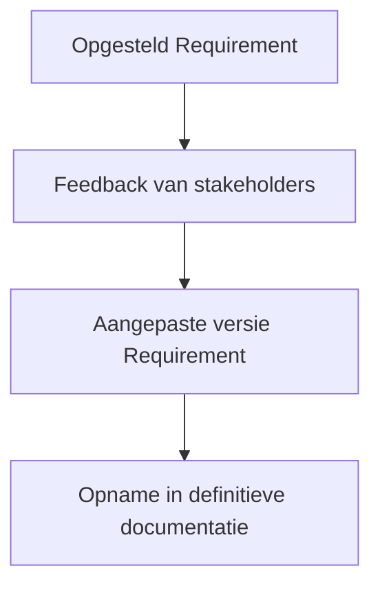

## Wat is het reviewen van requirements?
Het **reviewen van requirements** is het proces waarbij belanghebbenden feedback geven op de geformuleerde requirements om de kwaliteit ervan te beoordelen. Deze stap helpt bij het detecteren van onduidelijkheden, tegenstrijdigheden of ontbrekende informatie in een vroeg stadium van het ontwikkelproces.

Tijdens het **reviewen van requirements** worden de requirements besproken met verschillende stakeholders zoals gebruikers, ontwikkelaars van andere teams/afdelingen/organisaties, testers en opdrachtgevers. Hun feedback wordt verwerkt om tot een accurater, completer en beter afgestemd requirementsdocument te komen. Deze activiteit voorkomt misverstanden tijdens de ontwerp- en implementatiefase.

> [!TIP] Casus  
> Een team ontwikkelt een applicatie voor het boeken van studieplekken. In de eerste versie van de requirements staat: “De student moet kunnen reserveren.” Tijdens een review met studenten blijkt dat zij ook graag meerdere reserveringen tegelijk willen maken. Ook vraagt de onderwijscoördinator om een beperking op dubbele boekingen. Deze feedback wordt verwerkt in een nieuwe versie van de requirements, waarin het reserveringsproces preciezer wordt uitgewerkt.

## Hoe zit het reviewen van requirements in elkaar?
Het **reviewen van requirements** vindt meestal plaats in een context waarin meerdere stakeholders betrokken zijn. Denk aan gebruikers, product owners, ontwikkelaars van andere teams/afdelingen/organisaties, testers en opdrachtgevers. Elke stakeholdergroep heeft eigen belangen en perspectieven. Waar de gebruiker zich vooral richt op gebruiksgemak en functionaliteit, is de tester geïnteresseerd in controleerbaarheid en volledigheid, terwijl ontwikkelaars vooral kijken naar technische haalbaarheid.

Het proces is daardoor zelden lineair. Bijna altijd is sprake van een iteratieve benadering: feedback leidt tot aanpassing van requirements, wat vervolgens weer leidt tot nieuwe vragen of inzichten. Het is belangrijk dat je flexibel omgaat met veranderingen en voortdurend afstemming zoekt met de betrokken partijen.

Het succes van een review hangt sterk af van communicatie: het moet voor iedereen duidelijk zijn wat de requirement betekent, waarom die er staat, en hoe deze aansluit op het doel van het systeem. Een goede review is dus niet alleen inhoudelijk, maar ook afgestemd op de taal, kennis en zorgen van de betrokkenen. Door deze iteratieve samenwerking worden requirements niet alleen correcter, maar ook beter afgestemd op de werkelijkheid van de eindgebruikers en de technische mogelijkheden.

De uitkomsten van een review worden verwerkt in de requirementsdocumentatie. Geconstateerde onduidelijkheden, hiaten (ontbrekende onderdelen) of verbeterpunten worden aangepast of aangevuld. Soms betekent dit dat een requirement anders geformuleerd wordt, extra toelichting krijgt, of zelfs gesplitst wordt in meerdere onderdelen. Het is gebruikelijk dat de herzieningen expliciet worden vastgelegd, zodat voor iedereen duidelijk is wat er gewijzigd is en waarom. Dit bevordert de traceerbaarheid en voorkomt verwarring in latere fasen van het project.

## Hoe gebruik je het reviewen van requirements?
Je past het **reviewen van requirements** toe op het moment dat je een eerste versie van de requirements hebt opgesteld. Het doel is om deze versie te toetsen aan de praktijk, zodat het systeem dat wordt ontwikkeld aansluit bij de werkelijke behoefte van de gebruikers en de technische randvoorwaarden.

Alternatieven zoals formele inspecties of walkthroughs kunnen ingezet worden, maar voor veel projecten volstaat een informele review. In agile omgevingen gebeurt dit vaak in refinements of reviewmeetings.

> [!TIP] Casus  
> Bij de ontwikkeling van een leermanagementsysteem werkt een student het volgende requirement uit: “Docenten kunnen opdrachten uploaden.” Tijdens de review blijkt dat sommige docenten opdrachten liever inplannen voor later. Dit leidt tot een uitbreiding van de requirement met planningsfunctionaliteit.
>
>**Mogelijke uitwerking van de casus**  
>- Requirement 01: Docent kan via het dashboard een opdracht toevoegen aan een vak.  
>- Requirement 02: Docent kan instellen vanaf wanneer de opdracht zichtbaar is voor studenten.  
>- Requirement 03: Docent kan een deadline koppelen aan de opdracht.

### SCRUM
Binnen **SCRUM** worden requirements doorgaans vastgelegd als backlog-items. Het **reviewen van requirements** gebeurt informeel tijdens de *backlog refinement sessies*. Tijdens deze momenten bespreken het development team en de product owner samen de items, waarbij onduidelijkheden worden weggenomen en aanvullende wensen kunnen worden opgenomen.  

Daarnaast vindt er aan het einde van elke sprint een *Sprint Review* plaats. Hierin wordt het opgeleverde werk getoond aan de stakeholders en wordt hun feedback verzameld. Die feedback kan aanleiding zijn om bestaande of toekomstige backlog-items aan te passen.  

### SSDLC
Binnen de **Secure Software Development Life Cycle (SSDLC)** worden reviews uitgevoerd na het verzamelen en specificeren van de requirements, maar vóór het ontwerp start. Op dit moment zijn de eisen nog te beïnvloeden en kan worden gecontroleerd of de requirements volledig, ondubbelzinnig, consistent en haalbaar zijn.  

In een beveiligingsgerichte context wordt extra gelet op requirements die gaan over authenticatie, toegangscontrole, logging en andere beveiligingsaspecten. Het **reviewen van requirements** helpt om deze aspecten expliciet te maken voordat ze over het hoofd worden gezien in latere fasen van ontwerp of implementatie.

Kortom:  
- In **refinements** worden toekomstige requirements besproken en bijgesteld.  
- In de **sprint review** wordt feedback op gerealiseerde functionaliteit gebruikt om requirements te herzien of aan te vullen.  

Deze iteratieve manier van het **reviewen het requirements** sluit goed aan bij de veranderende inzichten tijdens een project.

> [!info] Bronnen  
> - Swart, N. (2022). *Handboek requirements*. Academische uitgeverij Eburon.  
> - Arendsen, M. et al. (2012). *Succes met de requirements*. Academic Service.

---

> Volgende stap: [[6. Aanpak valideren requirements|Aanpak valideren requirements]]
