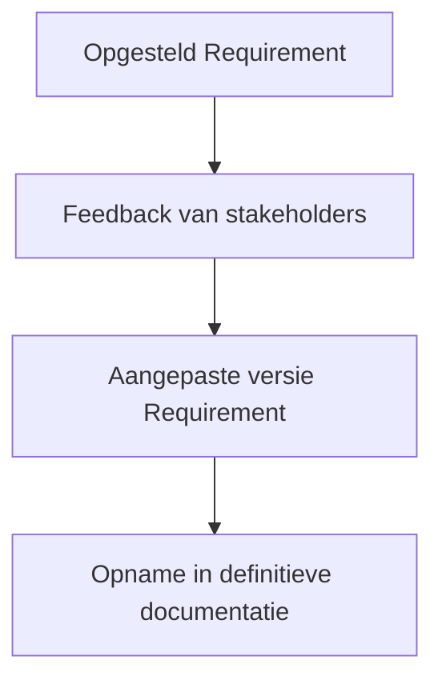

---
title: 5. Uitleg Valideren requirements
taxonomie:
  - rv-11.2.Valideren-requirements.OI
---

## Wat is reviewen requirements?
**Reviewen requirements** is het proces waarbij belanghebbenden feedback geven op de geformuleerde requirements om de kwaliteit ervan te beoordelen. Deze stap helpt bij het detecteren van onduidelijkheden, tegenstrijdigheden of ontbrekende informatie in een vroeg stadium van het ontwikkelproces.

Tijdens het **reviewen requirements** worden de requirements besproken met verschillende stakeholders zoals gebruikers, ontwikkelaars, testers en opdrachtgevers. Hun feedback wordt verwerkt om tot een accurater, completer en beter afgestemd requirementsdocument te komen. Deze activiteit voorkomt misverstanden tijdens de ontwerp- en implementatiefase.

> [!TIP] Casus  
> Een team ontwikkelt een applicatie voor het boeken van studieplekken. In de eerste versie van de requirements staat: “De student moet kunnen reserveren.” Tijdens een review met studenten blijkt dat zij ook graag meerdere reserveringen tegelijk willen maken. Ook vraagt de onderwijscoördinator om een beperking op dubbele boekingen. Deze feedback wordt verwerkt in een nieuwe versie van de requirements, waarin het reserveringsproces preciezer wordt uitgewerkt.

## Hoe zit reviewen requirements in elkaar?
Het reviewproces volgt meestal deze stappen:

1. **Voorbereiden van de review:**  
   - Stel een document of overzicht op met de opgestelde requirements.  
   - Zorg voor duidelijke structuur en nummering zodat feedback gericht gegeven kan worden.  
   - Nodig de relevante stakeholders uit voor de review.

2. **Uitvoeren van de review:**  
   - Organiseer een bijeenkomst of gebruik een digitaal platform waar iedereen de requirements kan doornemen.  
   - Stel gerichte vragen zoals: Begrijp je deze requirement? Zie je hiaten? Is dit wat je nodig hebt?

3. **Verwerken van de feedback:**  
   - Analyseer de ontvangen opmerkingen en bepaal welke aanpassingen nodig zijn.  
   - Werk de requirements bij en communiceer de wijzigingen terug naar de betrokkenen.  
   - Documenteer de herzieningen en beslissingen, bijvoorbeeld via versiebeheer of notulen.

4. **Herhalen indien nodig:**  
   - Soms is meerdere keren **reviewen requirements** nodig, vooral bij complexe of nieuwe systemen.  
   - Iteratief valideren zorgt voor steeds scherpere en bruikbaardere requirements.

## Hoe gebruik je reviewen requirements?
Je past **reviewen requirements** toe op het moment dat je een eerste versie van de requirements hebt opgesteld. Het doel is om deze versie te toetsen aan de praktijk, zodat het systeem dat wordt ontwikkeld aansluit bij de werkelijke behoefte van de gebruikers en de technische randvoorwaarden.

Alternatieven zoals formele inspecties of walkthroughs kunnen ingezet worden, maar voor veel projecten volstaat een informele review. In agile omgevingen gebeurt dit vaak in refinements of reviewmeetings.

> [!TIP] Casus  
> Bij de ontwikkeling van een leermanagementsysteem werkt een student het volgende requirement uit: “Docenten kunnen opdrachten uploaden.” Tijdens de review blijkt dat sommige docenten opdrachten liever inplannen voor later. Dit leidt tot een uitbreiding van de requirement met planningsfunctionaliteit.

**Mogelijke uitwerking van de casus**  
- Requirement 01: Docent kan via het dashboard een opdracht toevoegen aan een vak.  
- Requirement 02: Docent kan instellen vanaf wanneer de opdracht zichtbaar is voor studenten.  
- Requirement 03: Docent kan een deadline koppelen aan de opdracht.

### SSDLC
Binnen de **Secure Software Development Life Cycle (SSDLC)** worden reviews uitgevoerd na het verzamelen en specificeren van de requirements, maar vóór het ontwerp start. Op dit moment zijn de eisen nog te beïnvloeden en kan worden gecontroleerd of de requirements volledig, ondubbelzinnig, consistent en haalbaar zijn.  

In een beveiligingsgerichte context wordt extra gelet op requirements die gaan over authenticatie, toegangscontrole, logging en andere beveiligingsaspecten. **Reviewen requirements** helpt om deze aspecten expliciet te maken voordat ze over het hoofd worden gezien in latere fasen van ontwerp of implementatie.

### SCRUM
Binnen **SCRUM** worden requirements doorgaans vastgelegd als backlog-items. Het **reviewen requirements** gebeurt informeel tijdens de *backlog refinement sessies*. Hier bespreken het development team en de product owner samen de items, waarbij onduidelijkheden worden weggenomen en aanvullende wensen kunnen worden opgenomen.  

Daarnaast vindt er aan het einde van elke sprint een *Sprint Review* plaats. Hierin wordt het opgeleverde werk getoond aan de stakeholders en wordt hun feedback verzameld. Die feedback kan aanleiding zijn om bestaande of toekomstige backlog-items aan te passen.  

Kortom:  
- In **refinements** worden toekomstige requirements besproken en bijgesteld.  
- In de **sprint review** wordt feedback op gerealiseerde functionaliteit gebruikt om requirements te herzien of aan te vullen.  

Deze iteratieve manier van **reviewen requirements** sluit goed aan bij de veranderende inzichten tijdens een project.

> [!info] Bronnen  
> - Swart, N. (2022). *Handboek requirements*. Academische uitgeverij Eburon.  
> - Arendsen, M. et al. (2012). *Succes met de requirements*. Academic Service.

---

> Volgende stap: [[6. Uitleg beheren requirements|Uitleg beheren requirements]]
