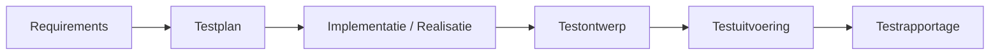

## Overzicht testen in de praktijk

Dit schema laat zien hoe testen in de praktijk verloopt. Je begint met de **requirements**: wat moet het systeem doen? Daarna bepaal je in het **testplan** hoe je het testen gaat aanpakken. Tijdens de **implementatie** bouw je de oplossing. In het **testontwerp** werk je uit wat je precies gaat testen. Daarna voer je de testen uit en leg je de resultaten vast in de **testrapportage**.

## Uitleg per stap
Onderstaand zijn de verschillende fases van het testen uitgewerkt.

### Requirements
Hier staat wat de applicatie moet doen. Denk aan eisen, wensen, acceptatiecriteria of onderdelen uit een functioneel ontwerp. Dit vormt de basis voor zowel de realisatie als het testen.

### Testplan
In het testplan bepaal je de aanpak van het testen. Je kijkt naar welke testsoorten je gaat gebruiken, welke omgevingen gebruikt zullen worden, hoe de prioritering van testen wordt bepaald en met welke testinspanningen gewerkt wordt. Het testplan geeft dus richting aan het testproces.

### Implementatie / Realisatie
In deze fase wordt de functionaliteit gebouwd. Je werkt de oplossing uit in de applicatie en houdt rekening met kwaliteit, structuur en testbaarheid.

### Testontwerp
Hier vertaal je requirements en use cases naar concrete testen. Je bepaalt welke testscenario’s belangrijk zijn, werkt testcases uit en beschrijft wat het verwachte resultaat moet zijn. Dit is dus de stap waarin je voorbereidt **wat je straks echt gaat controleren**.

### Testuitvoering
Nu worden de ontworpen testcases uitgewerkt en uitgevoerd. Je vergelijkt het werkelijke resultaat met het verwachte resultaat en noteert afwijkingen of fouten. Dit kunnen automatische of handmatige testen zijn.

### Testrapportage
In deze stap leg je vast wat er getest is, wat de uitkomst was en welke bevindingen daarbij horen. Zo wordt duidelijk wat goed werkt en welke onderdelen nog aandacht nodig hebben.

## Kort samengevat
* **Requirements**: wat moet het systeem doen?
* **Testplan**: hoe ga je het testen aanpakken?
* **Implementatie / Realisatie**: bouw de functionaliteit
* **Testontwerp**: werk uit wat je precies gaat testen
* **Testuitvoering**: voer de testen uit
* **Testrapportage**: leg resultaten en bevindingen vast

## In de praktijk
In de praktijk begin je dus niet meteen met testen. Eerst moet duidelijk zijn wat gebouwd moet worden. Daarna bepaal je de testaanpak. Tijdens en na het bouwen ontwerp je de testen, vervolgens voer je ze uit en tenslotte rapporteer je de resultaten. Zo ontstaat een logisch proces van **begrijpen, bouwen, controleren en vastleggen**.
