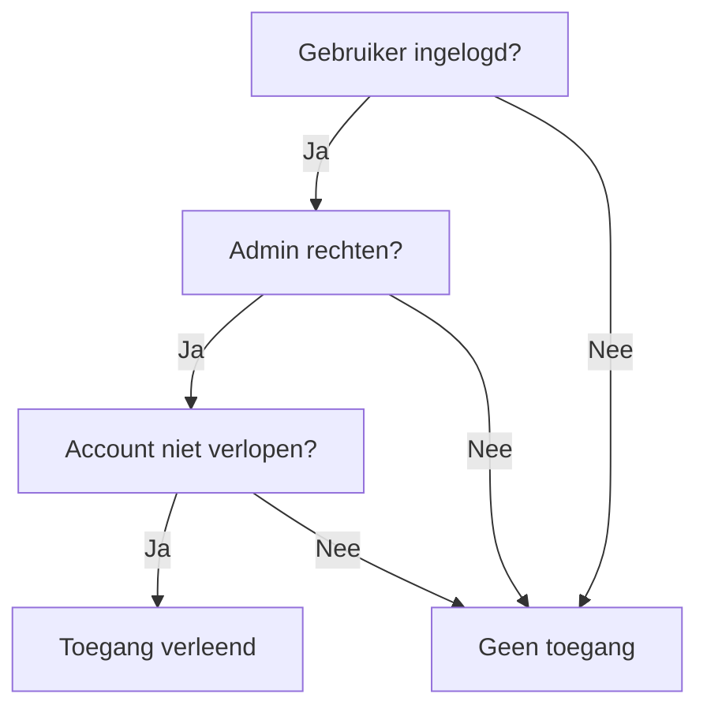

## Wat is een propositie?
Een **propositie** is een uitspraak die of waar of onwaar is. Een **propositie** is een basiscomponent in logica en vormt de kern van waarheidswaarden. Voorbeelden van **proposities** zijn:
- "Zutphen ligt in Frankrijk" (Onwaar)
- "5 > 6" (Onwaar)
- "Een week heeft zeven dagen" (Waar)

Een propositie is dus altijd een uitspraak die een concrete waarheidswaarde kan aannemen, namelijk 'waar' of 'onwaar'.

> [!TIP] Casus
> Stel dat je in een programmeertaal een functie hebt die controleert of een gebruiker is ingelogd. De uitkomst van die functie is een propositie: ofwel de gebruiker is ingelogd (waar) of niet (onwaar).

## Hoe zit een propositie in elkaar?
Een **propositie** kan opgedeeld worden in drie verschillende soorten **proposities**:
- **Enkelvoudige proposities:** "Het regent" of "Het waait"
- **Ontkenningen van proposities:** "Het regent niet" of "Het waait niet"
- **Samengestelde proposities:** Dit zijn proposities waarin andere proposities zijn opgenomen, bijvoorbeeld: "Het regent of het waait" of "Het regent en het waait niet"

Een samengestelde propositie bestaat uit verschillende onderdelen:
- Logische operator: Er moet een logische operator aanwezig zijn om te bepalen hoe de twee waarden vergeleken worden (in code zijn [[1. Uitleg logische operatoren|logische operatoren]] ook aanwezig).
- Twee proposities: Er moeten minimaal twee waarden zijn die vergeleken worden tegen elkaar.

```
Waarde1 Logische_Operator Waarde2
Bijvoorbeeld:
'Het regent' -> 'Het waait'
```

Met proposities zijn er een aantal standaard tekens die gebruikt worden om de logica weer te geven. Deze zijn als volgt:

| Naam         | Teken             | Betekenis                                           |
| ------------ | ----------------- | --------------------------------------------------- |
| Negatie      | $\neg$            | Keert de waarheidswaarde om                         |
| Conjunctie   | $\wedge$          | En-operator, beide uitspraken moeten waar zijn.     |
| Disjunctie   | $\vee$            | Of-operator, minstens één uitspraak moet waar zijn. |
| Implicatie   | $\to$             | Als... dan...-constructie.                          |
| Equivalentie | $\leftrightarrow$ | Beide uitspraken hebben dezelfde waarheidswaarde.   |
De volgorde van de tabel is ook de volgorde hoe deze in een propositie moeten worden verwerkt (zoals met $+, \ -, \ * \ en \ /$ bij sommen)

> [!warning] Let op
> Bij een implicatie wordt alleen gespecificeerd als *a* gebeurt. Er wordt geen uitspraak gedaan als *a* niet gebeurt. Als bij een implicatie de linker helft van de propositie niet waar is, dan wordt automatisch de uitkomst van de propositie waar.
> 
> **Bijvoorbeeld:**
> Stel je zegt: "Als ik een voldoende haal, dan trakteer ik op taart."
> 
> Nu zijn er vier scenario's:
> 1. Je haalt een voldoende én je trakteert → belofte nagekomen (waar).
> 2. Je haalt een voldoende, maar je trakteert niet → belofte verbroken (onwaar).
> 3. Je haalt géén voldoende, maar je trakteert toch → geen belofte gedaan, dus oké (waar).
> 4. Je haalt géén voldoende en trakteert ook niet → ook prima, je had niets beloofd (waar).
> 
> Uit deze scenario's is het volgende af te leiden:  
> > Als de linker propositie niet waar is ("Je haalt géén voldoende"), dan maakt het niet uit wat er aan de rechterkant gebeurt ("Je trakteert" of "je trakteert niet").  
> 
> Je hebt immers alleen iets beloofd _als_ je een voldoende zou halen. Omdat je die niet gehaald hebt, kun je je belofte niet breken – en daarom geldt:  De hele uitspraak is dan automatisch waar.
> 
> Je zegt eigenlijk: _"Alleen als ik een voldoende haal, heb ik iets beloofd."_  
> Geen voldoende gehaald? Dan was er geen belofte → geen probleem → de uitspraak klopt dus nog steeds.

### Voorbeeld
$$
\begin{array}{l}
A = true \\
B = false \\
\\
\neg A = false \\
\text{A is true, dus wordt dit de omgekeerde waarde} \\
\\
A \wedge B = false \\
\text{Er wordt gevraagd om een "en" operatie. B is false, waardoor de propositie ook false is} \\
 \\
A \vee B = true\\
\text{Er wordt gevraagd om een "of" operatie. A is true, waardoor de propositie ook true is} \\
 \\
A \to B = false  \\
 \text{Hier wordt gesteld dat als A true is, B ook true moet zijn, wat niet het geval is, dus is het false.} \\
 \\
A \leftrightarrow B = false \\
\text{Hier wordt gesteld dat A en B dezelfde waarde moeten hebben om waar te zijn.} \\
\end{array}
$$

### Codevoorbeeld
```csharp
bool p = true;
bool q = false;

Console.WriteLine(!p);  // Negatie: false
Console.WriteLine(p && q);  // Conjunctie: false
Console.WriteLine(p || q);  // Disjunctie: true
Console.WriteLine(p == q);  // Equivalentie: false
```

## Hoe gebruik je een propositie?
Proposities kunnen gebruikt worden in zowel berekeningen waarbij logische berekeningen gedaan moeten worden, als bij programmeertalen zoals C#. Proposities worden vaak gebruikt in controle-structuren, zoals [[1. Uitleg If-Else|if-else]], [[1. Uitleg While|while]], [[1. Uitleg For|for]] en [[1. Uitleg Switch|switch]].

> [!TIP] Casus 
> Stel dat je een programma maakt dat bepaalt of een gebruiker toegang heeft tot een specifieke sectie van een website. De voorwaarden voor toegang zijn:
> - De gebruiker is ingelogd.
> - De gebruiker heeft admin-rechten.
> - Het account is niet verlopen.
> 
> **Mogelijke uitwerking van de casus**
> ```csharp
> bool isLoggedIn = true;
> bool isAdmin = false;
> bool accountNotExpired = true;
>
> bool hasAccess = isLoggedIn && isAdmin && accountNotExpired;
> Console.WriteLine("Toegang: " + hasAccess);
> ```



### Propositie logica concepten
Bij propositie logica zijn er een standaard aantal concepten die informatie kunnen geven over de uitkomst van een propositie
- **Tautologie:** Een tautologie is een propositie die altijd waar is, zoals: "De deur is open of de deur is niet open" of $P \vee \neg P$ (P of het omgekeerde P)
- **Contradictie:** Een contradictie is een propositie die altijd onwaar is, zoals "Het regent en het regent niet" en $P \wedge \neg p$ (p en het omgekeerde van P)
- **Contingentie:** Elke prospositie die niet een tautologie of contradictie is, is automatisch een contingentie.

---

> Volgende stap: [[2. Stappen propositie logica|Stappen propositie logica]]
