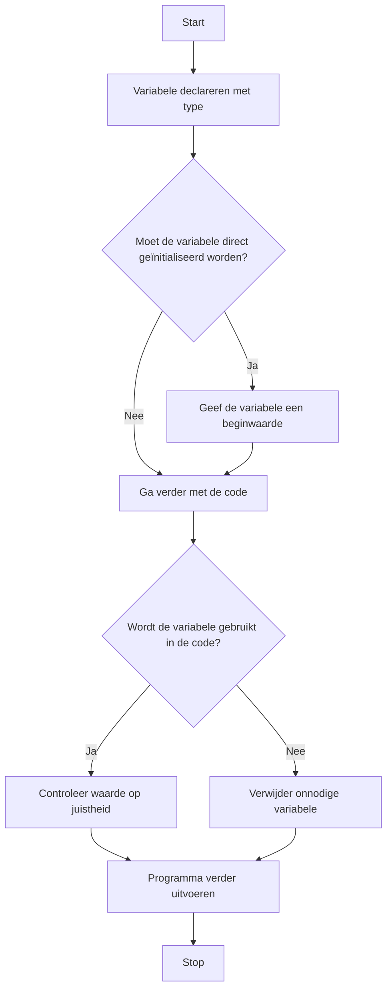

> Meer informatie over [[content/2. Ondersteunende-informatie/3. Processen/4. Implementatieproces/2. Bouwen softwaresysteem/Datatype/1. Declaratie|1. Declaratie]]

## Stappen in de Systematische Probleem Aanpak
### 1. Doel
Het doel van een declaratie is om aan te geven wat voor soort data een variabele bevat en hoe deze in het programma gebruikt wordt.

### 2. Subdoelen
Splits het probleem in subdoelen:
- Welke soort informatie moet de variabele opslaan?
	- Bijvoorbeeld: een getal, tekst of een complex object.
- Waar moet de informatie van deze variabele beschikbaar zijn?
	- Bijvoorbeeld: binnen een functie, een klasse, of in het hele programma.

>[!TIP] Casus
> Stel, je bouwt een registratiesysteem voor een website. Een variabele kan bijvoorbeeld de gebruikersnaam opslaan. Kies een logische naam zoals `gebruikersnaam` en `String` als datatype, omdat gebruikersnamen uit tekst bestaan.

### 3. Fasen
1. **Type gewenste waarde**
   **Actie**: Bepaal het type van de gewenste waardes van het variabel.
   **Resultaat**: Type dat variabel opslaat.
2. **Naam variabel**
   **Actie**: Bepaal de naam van het variabele, probeer een duidelijke en beschrijvende naam te kiezen.
   **Resultaat**: Naam voor je variabel
3. **Beschikbaarheid variabel**
   **Actie**: Bepaal waar je je variabel wilt kunnen gebruiken, als deze alleen nodig is in een functie kan je deze binnen de functie declareren. Anders kan deze binnen een klasse met private als deze alleen binnen de klasse nodig is of public als je deze overal wil kunnen gebruiken
   **Resultaat**: 
4. **Beginwaarde variabel**
   **Actie**: Kijk of je variabel een beginwaarde nodig heeft wanneer je deze declareert.
   **Resultaat**: Een (mogelijke) beginwaarde voor je variabel en locatie voor het opslaan

### Correctieve feedback tijdens de uitvoer
#### Fouten detecteren
* **Vergeten datatypes te specificeren**: Controleer of alle variabelen correct zijn gedeclareerd met het juiste datatype. Bijvoorbeeld, als een variabele een decimaal getal moet opslaan, gebruik dan `float` of `double` in plaats van `int`.
* **Naamgevingsproblemen**: Zorg dat variabelen duidelijke, beschrijvende namen hebben. Vermijd algemene namen zoals `x`, `y` of `data`, tenzij ze relevant zijn voor de context.
* **Niet-geïnitialiseerde variabelen**: Controleer of alle variabelen een waarde krijgen voordat ze worden gebruikt in berekeningen of logica.
* **Verkeerde initialisatie**: Let op dat een variabele wordt geïnitialiseerd met de juiste waarde. Bijvoorbeeld, een teller begint meestal bij `0` in plaats van `1`, tenzij anders vereist.

> [!INFO] Tip  
> Controleer tijdens het testen of de waarden van variabelen overeenkomen met je verwachtingen door ze naar de console te printen (bijvoorbeeld met `Console.WriteLine()`).

### Tips voor efficiënt gebruik van declaratie
- **Vermijd onnodige variabelen**: Gebruik geen variabelen die niet nodig zijn voor je programma. Ze kunnen verwarring veroorzaken en geheugen verspillen.
- **Gebruik betekenisvolle namen**: Zorg dat variabelen beschrijven wat ze vertegenwoordigen. Bijvoorbeeld: gebruik `aantalStoelen` in plaats van `x`.
- **Minimaliseer duplicatie**: Vermijd het opslaan van dezelfde waarde in meerdere variabelen. Als een waarde meerdere keren wordt gebruikt, overweeg om een enkele variabele te gebruiken of een constante te declareren.
- **Initialiseer direct**: Wanneer mogelijk, geef variabelen meteen een beginwaarde om fouten door niet-geïnitialiseerde variabelen te voorkomen.

---

> Volgende stap: [[content/4. Deeltaken/3. Processen/4. Implementatieproces/2. Bouwen softwaresysteem/1. Declaratie|Deeltaken]]