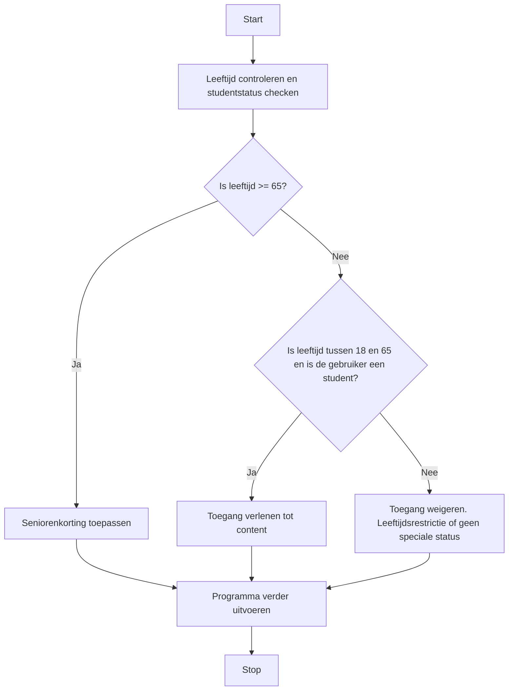

> Meer informatie over [[content/2. Ondersteunende-informatie/3. Processen/4. Implementatieproces/2. Bouwen softwaresysteem/Switch/1. Switch|1. Switch]]

## Stappen in de Systematische Probleem Aanpak
### 1. Doel
Bepaal de reden voor het gebruik van een *Switch-Case*-structuur. Bijvoorbeeld: Het programma moet beslissingen kunnen nemen op basis van een variabele.

### 2. Subdoelen
Splits het probleem in subdoelen, zoals:
  - Het vaststellen van de variabele die getoetst moet worden.
  - Het vaststellen welke waardes de variabele kan aannemen.
  - Het formuleren van de actie(s) die gedaan moeten worden op basis van de waardes.

> [!info] Tip 
> Het vaststellen van de waardes en acties kan je erg eenvoudig inventariseren door er een tabel van te maken. In de linker kolom zet je dan de waarde van het variabele en in de rechter kolom de actie die bij de conditie hoort. Bedenk ook of er iets standaard moet gebeuren als er de waarde niet onder de rest van de waardes valt

>[!TIP] Casus
> **Gegeven is de volgende tekst:**
> Bij de ingang van een museum wordt de leeftijd van de bezoekers gecontroleerd. Wanneer de bezoeker 4 of jonger is, wordt er geen toegang verleend. Wanneer de bezoeker tussen de 4 en 8 is, krijgt de bezoeker jongerenkorting. Wanneer de bezoeker 65 of ouder is, krijgt de bezoeker seniorenkorting.
>
> **Zet deze tekst om in een tabel:**
> 
> | Conditie                                    | Actie                   |
> | ------------------------------------------- | ----------------------- |
> | Als leeftijd >= 65                          | Seniorenkorting toepassen |
> | Als leeftijd <= 4  | Toegang weigeren |
> | Als leeftijd > 4 en < 8  | Jongerenkorting toepassen |
> | In alle andere gevallen | Geen korting toepassen |

### 3. Fasen:
1. **Variabel Identificeren**  
   **Actie**: Identificeer de variabele waarover het programma keuzes moet gaan maken.  
   **Resultaat**: Gedefinieerd variabele zoals `leeftijd`.

2. **Waardes Analyseren**  
   **Actie**: Bepaal de mogelijke waarden die de variabelen kan aannemen en waarop de condities gebaseerd moeten worden. Maak de keuze of er mogelijk ook een default case bij hoort.
   **Resultaat**: Een lijst van mogelijke waarden, zoals leeftijden (bijvoorbeeld. 65+ voor senioren, tussen de 4 en 8 voor jongeren, maar nooit onder de 0).

3. **Condities Analyseren**  
   **Actie**: Identificeer de condities waarop beslissingen moeten worden gebaseerd.  
   **Resultaat**: Overzicht van condities, zoals "leeftijd >= 65" of "leeftijd > 4 en < 8".

4.  **Volgorde bepalen** (alleen nodig bij getallen)                                                                                **Actie**: Bepaal de volgorde van de cases zodat er geen tegenstrijdigheid is. Bijvoorbeeld eerst "leeftijd < 8" en daarna "leeftijd < 4" betekent dat de <4 case nooit wordt uitgevoerd. **Resultaat:** Een juiste volgorde van de cases.

6. **Acties per Conditie Bepalen**  
   **Actie**: Specificeer welke actie het programma moet uitvoeren als een bepaalde case waar is. 
   **Resultaat**: Acties gekoppeld aan condities.

6. **Test en Valideer**  
   **Actie**: Test de switch-case met verschillende invoerwaarden om te verifiëren dat de structuur correct werkt.  
   **Resultaat**: Een gevalideerde switch-case die gewenste uitkomsten levert.

### Correctieve feedback tijdens de uitvoer
#### Fouten detecteren
Bij een foutmelding, zoals een onverwachte uitkomst, herken je de fout door te kijken naar de specifieke conditie die mogelijk onjuist is gedefinieerd. 
- **Fout in logica**: Als een conditie niet correct werkt, controleer of de operatoren de juiste relatie tussen voorwaarden aangeven. Bijvoorbeeld, verander `&&` naar `||` als dat nodig is.
- **Fout in syntax**: Zorg ervoor dat alle haakjes correct zijn geplaatst om de volgorde van evaluatie te waarborgen. Gebruik bijvoorbeeld `((conditie1 && conditie2) || conditie3)` voor duidelijkheid.
#### Fouten detecteren
Bij een foutmelding, zoals een onverwachte uitkomst in een switch-case-structuur, herken je de fout door te kijken naar de specifieke case die mogelijk onjuist is gedefinieerd of ontbreekt.
- **Fout in logica**: Controleer of de waarden in de `case`-labels overeenkomen met de verwachte input. Zorg ervoor dat elke relevante waarde wordt afgehandeld. Bijvoorbeeld, als een waarde niet correct wordt gematcht, voeg een extra `case` toe of pas de bestaande cases aan.
- **Fout in syntax**: Controleer op ontbrekende of verkeerd geplaatste `break`-statements.

> [!INFO] Tip  
> Gebruik de Switch-Case alleen wanneer er meerdere keuzes gemaakt moeten worden. Bij eenvoudige keuzes voldoet een If-Else-structuur

### Tips voor efficiënt gebruik van If-Else-structuren
- **Vermijd overmatige If-Else-structuren** door te overwegen of `else if`-clausules of `switch`-cases effectiever zijn.
- **Gebruik haakjes** om complexe logica duidelijk te structureren, wat bijdraagt aan de leesbaarheid.
- **Test met flowcharts** voor overzicht bij meerdere if-else regels, zoals:

---

> Volgende stap: [[content/4. Deeltaken/3. Processen/4. Implementatieproces/2. Bouwen softwaresysteem/1. If-Else|Deeltaken]]
