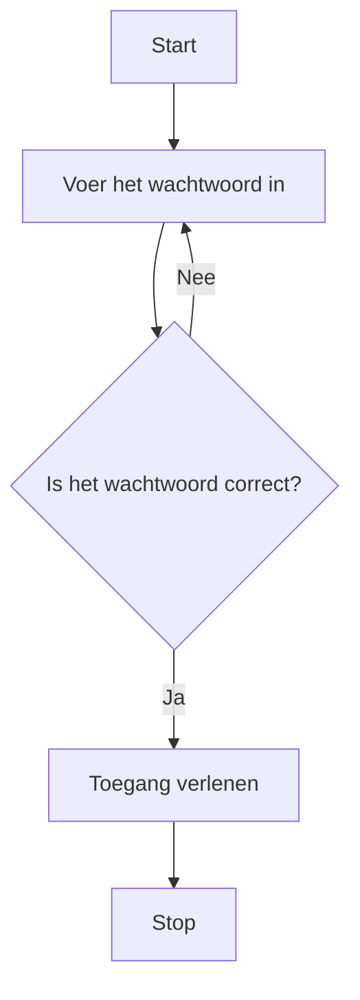

> Meer informatie over [[content/2. Ondersteunende-informatie/3. Processen/4. Implementatieproces/2. Bouwen softwaresysteem/While/1. While|While]]

## Stappen in de Systematische Probleem Aanpak
### 1. Doel
Bepaal waarom een **While**-loop nodig is. Bijvoorbeeld: Het programma moet een taak herhalen totdat aan een specifieke voorwaarde wordt voldaan.

### 2. Subdoelen
Splits het probleem in subdoelen, zoals:
	• Het vaststellen van de herhalingsconditie.
	• Het bepalen van de acties die moeten worden uitgevoerd zolang de conditie waar is.

> [!info] Tip
> Bedenk bij het ontwerpen van een _While_-loop altijd: “Wat moet er gebeuren voordat de loop stopt?” Zorg ervoor dat de conditie duidelijk definieert wanneer de herhaling moet eindigen en dat je variabelen binnen de loop bijwerkt om een oneindige lus te voorkomen.

> [!TIP] Casus
> **Gegeven is de volgende tekst:**
> Een gebruiker probeert in te loggen. Het programma vraagt steeds om een gebruikersnaam en wachtwoord totdat beide correct zijn ingevoerd. Zodra de juiste combinatie is gegeven, krijgt de gebruiker toegang tot het systeem en stopt het vragen naar inloggegevens.
> 
> **Zet deze tekst om in een tabel:**
> 
> | Conditie                                    | Actie                   |
> | ------------------------------------------- | ----------------------- |
> | Gebruikersnaam of wachtwoord onjuist                         | Vraag opnieuw om beide |
> | Gebruikersnaam en wachtwoord juist  | Verleen toegang en stop loop        |

### 3. Fasen
1. **Parameters/Variabelen Identificeren**
	**Actie**: Bepaal de variabelen die nodig zijn voor de controle in de While-loop en definieer deze vooraf. Bijvoorbeeld, als je een invoerwaarde wilt controleren, kun je een variabele zoals `string input` en `string correctPassword` gebruiken.
	**Resultaat**: Vooraf gedefinieerde variabelen zoals `string input` en `string correctPassword`, zodat deze zonder fouten in de loop kunnen worden gebruikt. Let erop dat variabelen altijd een type en startwaarde nodig hebben voordat ze in een controle worden toegepast.

2. **Waardes Analyseren**
	**Actie**: Analyseer de mogelijke waarden van de variabelen die in de loop worden gebruikt. Denk na over wat de gebruiker kan invoeren en hoe de loop daarmee om moet gaan.
	**Resultaat**: Een overzicht van mogelijke invoerwaarden, zoals wachtwoorden of andere gebruikersinput.

3. **Condities Formuleren**
	**Actie**: Formuleer de conditie die bepaalt of de loop wordt herhaald, gebaseerd op de mogelijke waarden van de variabelen.
	**Resultaat**: Een duidelijke herhalingsconditie, zoals `input != correctPassword`, die de werking van de loop stuurt.

4. **Acties binnen de Loop Specificeren**
	**Actie**: Bepaal welke acties worden uitgevoerd zolang de conditie waar is.
	**Resultaat**: Geïmplementeerde acties zoals het vragen om nieuwe invoer.

5. **Bouw de While-Loop in Code**
	**Actie**: Implementeer de herhalingsstructuur in de code.
	**Resultaat**: Een volledig werkende While-loop met logische controles en acties.

6. **Test en Valideer**
	**Actie**: Test de While-loop met verschillende scenario’s om te controleren of deze correct functioneert.
	**Resultaat**: Een gevalideerde loop die onder alle omstandigheden de verwachte uitkomsten levert.

### Correctieve feedback tijdens de uitvoer
#### Fouten detecteren
Bij een fout in de uitvoer kun je de volgende aspecten controleren:
	• **Fout in logica**: Controleer of de conditie correct is geformuleerd. Bij een oneindige loop kan bijvoorbeeld de conditie altijd waar blijven.
	• **Fout in invoer**: Controleer of de acties in de loop juist zijn geïmplementeerd en of variabelen goed worden bijgewerkt.
	• **Controle van variabelen**: Controleer de inkomende en uitgaande waarden van variabelen. Dit helpt bij het lokaliseren van fouten door te bepalen of de data correct wordt verwerkt tijdens de loop.

> [!INFO] Tip
> Test het programma met verschillende invoerscenario’s, zoals onverwachte of randwaarden, om mogelijke fouten te identificeren.

### Tips voor efficiënt gebruik van While-loops
- **Vermijd oneindige loops** door ervoor te zorgen dat de conditie uiteindelijk altijd onwaar kan worden.
- **Gebruik duidelijke condities** om de logica van de loop makkelijk te begrijpen en onderhouden.
- **Combineer met do-While** als minstens één uitvoering van de code gegarandeerd nodig is.

---

Volgende stap: [[content/4. Deeltaken/3. Processen/4. Implementatieproces/2. Bouwen softwaresysteem/While/1. While|Deeltaken]]