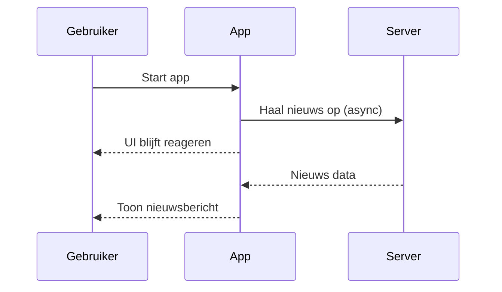

## Wat is async & await?
In C# worden **async en await** gebruikt om **asynchrone methodes** te schrijven. Asynchrone methodes voeren code uit **zonder het programma te blokkeren**. Hierdoor blijft bijvoorbeeld een gebruikersinterface responsief tijdens lange of trage bewerkingen, zoals het ophalen van data of het inlezen van bestanden.

Met **async** geef je aan dat een methode asynchroon is. Met **await** geef je aan waar je wilt wachten op het resultaat van een andere asynchrone operatie, maar zonder het programma te pauzeren.

> [!TIP] Casus
> Stel, je schrijft een applicatie die gegevens van een externe API ophaalt. Zonder **async en await** zou de app “bevriezen” totdat de API een antwoord teruggeeft. Met **async en await** blijft de app reageren op input, terwijl op de achtergrond wordt gewacht op een antwoord van de API.

## Hoe zit async & await in elkaar?
In C# retourneert een methode met **async** meestal een `Task<T>`. Wanneer je **await** gebruikt op een `Task`, zeg je eigenlijk: “wacht hier op de uitkomst, maar geef de controle tijdelijk terug aan de aanroeper.”

Je kunt alleen **await** gebruiken binnen een methode die als **async** is gemarkeerd.

### Codevoorbeeld
```csharp
using System;
using System.Net.Http;
using System.Threading.Tasks;

class Program
{
    static async Task Main()
    {
        string inhoud = await HaalDataOpAsync("https://example.com");
        Console.WriteLine(inhoud);
    }

    static async Task<string> HaalDataOpAsync(string url)
    {
        using HttpClient client = new HttpClient();
        string result = await client.GetStringAsync(url);
        return result;
    }
}
```

**In dit voorbeeld:**
- `HaalDataOpAsync` is een methode die asynchroon data ophaalt van het internet.
- De methode is gemarkeerd met **async** en retourneert een `Task<string>`.
- De **await**-expressie wacht op het resultaat van `client.GetStringAsync(url)`.

## Hoe gebruik je async & await?
Gebruik **async en await** wanneer je:
- tijdrovende operaties uitvoert (bv. bestands- of netwerktoegang),
- wilt voorkomen dat je gebruikersinterface bevriest,
- meerdere taken tegelijk wilt uitvoeren.

### Alternatieven
Je zou ook `ContinueWith()` kunnen gebruiken of `Task.Run()`, maar deze maken de code vaak moeilijker leesbaar en onderhoudbaar. **Async en await** zorgen juist voor duidelijke en leesbare code.

> [!TIP] Casus
> Je maakt een app die van een website nieuwsberichten moet ophalen. De gebruiker mag ondertussen andere functies van de app blijven gebruiken.
> Voor deze app zijn een aantal eisen gesteld:
> - De app moet nieuws ophalen van een externe URL.
> - De gebruiker mag tijdens het laden niet hoeven wachten.
> - Na het laden moet het resultaat op het scherm verschijnen.
> 
> Mogelijke uitwerking van de casus
> ```csharp
> using System;
> using System.Threading.Tasks;
> using System.Net.Http;
> 
> class NieuwsApp
> {
>     public async Task Start()
>     {
>         Console.WriteLine("Ophalen van nieuws...");
>         string nieuws = await HaalNieuwsOpAsync();
>         Console.WriteLine($"Nieuws ontvangen: {nieuws}");
>     }
>
>     private async Task<string> HaalNieuwsOpAsync()
>     {
>         using HttpClient client = new HttpClient();
>         string response = await client.GetStringAsync("https://nieuws.example.com");
>         return response;
>     }
> }
> ```



> [!info] Bronnen
> Microsoft async programming guide: https://learn.microsoft.com/en-us/dotnet/csharp/programming-guide/concepts/async/

---

> Volgende stap: [[2. Stappen Async en Await|Stappen Async en Await]]