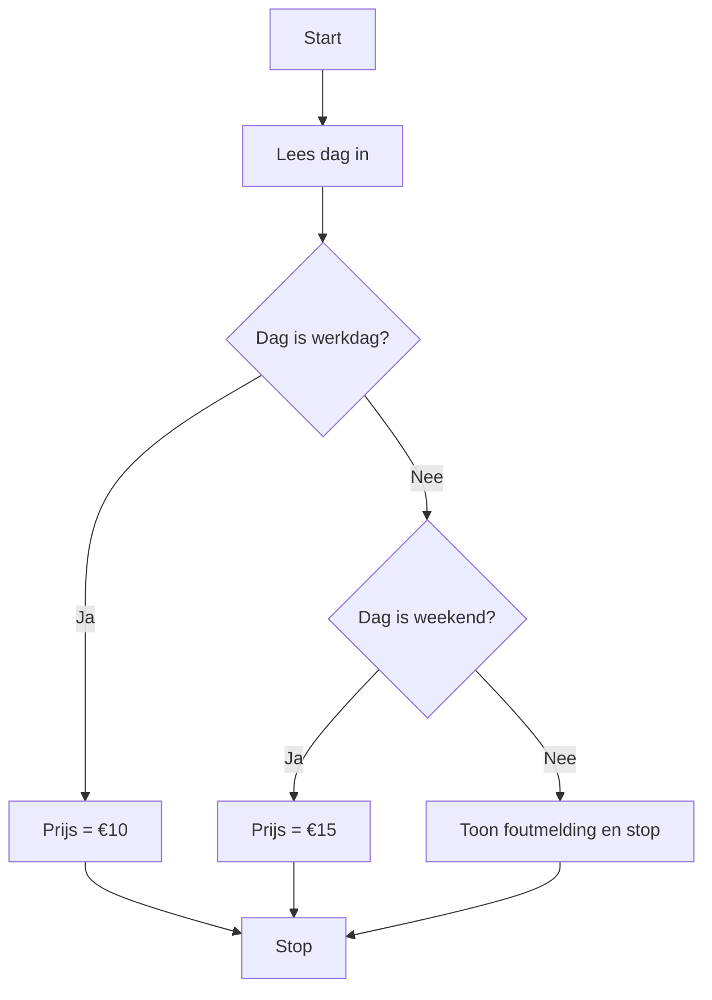

> Meer informatie over [[1. Uitleg Switch|switch-case-structuur]]

## Stappen in de Systematische Probleem Aanpak
### 1. Doel
Bepaal waarom een **switch-case-structuur** nodig is. Bijvoorbeeld: het programma moet op basis van een variabele met meerdere mogelijke vaste waarden (zoals dagen, maanden of codes) een specifieke actie uitvoeren.

### 2. Subdoelen
Splits het probleem in beheersbare stappen:

* Identificeer de variabele of expressie die getest wordt.
* Bepaal alle mogelijke waarden (cases) die voor de variabele relevant zijn.
* Groepeer waarden die naar dezelfde actie leiden.
* Definieer een `default`-case voor onvoorziene of foutieve invoer.

> [!TIP] Casus
> **Gegeven is de volgende tekst:**
> Een reserveringssysteem bepaalt de prijs op basis van de dag van de week: maandag t/m vrijdag €10, zaterdag en zondag €15, voor andere invoer een foutmelding.
>
> **Zet deze tekst om in een tabel:**
> | Dag                        | Actie                    |
> | -------------------------- | ------------------------ |
> | maandag, dinsdag, …vrijdag | Prijs instellen op €10   |
> | zaterdag, zondag           | Prijs instellen op €15   |
> | anders                     | Toon foutmelding en stop |

### 3. Fasen
1. **Parameters/Variabelen identificeren**
   **Actie**: Bepaal welke variabele of expressie de **switch**-clausule krijgt, bijvoorbeeld `string dag` of `int code`.
   **Resultaat**: Vooraf gedefinieerde variabele met een startwaarde.

2. **Waardes analyseren**
   **Actie**: Maak een overzicht van alle mogelijke invoerwaarden en wat er bij elke waarde moet gebeuren.
   **Resultaat**: Lijst van waarden en bijbehorende acties.

3. **Cases groeperen**
   **Actie**: Groepeer meerdere `case`-labels die leiden naar dezelfde actie door ze onder elkaar te plaatsen zonder `break`.
   **Resultaat**: Efficiënte structuur waarin verwante waarden samenkomen.

4. **Default-Case specificeren**
   **Actie**: Bepaal wat er moet gebeuren bij ongeldige of onverwachte invoer.
   **Resultaat**: `default`-clausule met foutafhandeling of standaardactie.

5. **Bouw de switch-case in code**
   **Actie**: Implementeer de **switch**-structuur in C#, met `case`, `break` en `default`.
   **Resultaat**: Werkende code die elke waarde correct afhandelt.

6. **Test en valideer**
   **Actie**: Voer de code uit met alle verwachte én onverwachte waarden om te controleren op correcte afhandeling.
   **Resultaat**: Een gevalideerde `switch-case`-structuur zonder onverwachte uitkomsten.

### Correctieve feedback tijdens de uitvoer
- **Onbekende invoer**: Toon direct een foutmelding zoals "Ongeldige dag: {input}. Probeer opnieuw." en vraag om nieuwe invoer.
- **Casegevoeligheid**: Geef aan dat invoer hoofdletterongevoelig is, bijvoorbeeld "Invoer niet herkend. Let op: dagen zonder hoofdletters invoeren.".
- **Her-kans**: Vraag de gebruiker om de waarde opnieuw in te voeren totdat een geldige case wordt bereikt.
- **Succesmelding**: Geef bij geldige invoer een bevestiging, bijvoorbeeld "Invoer {dag} herkend. Prijs ingesteld.".

---

> Volgende stap: [[3. Oefeningen Switch|Oefeningen switch]]
