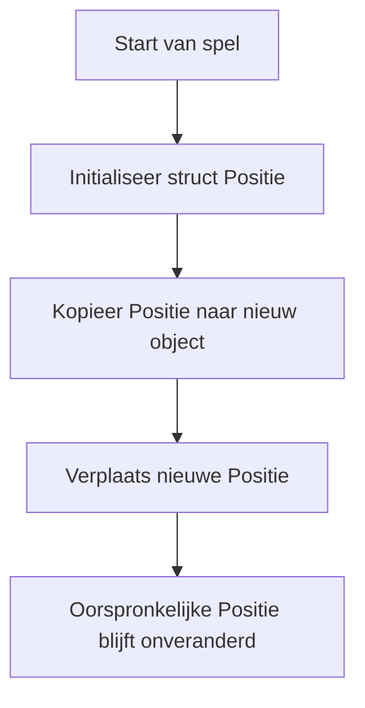

## Wat is een struct?
Een **struct** (afkorting van _structure_) is een **value type** in C# dat je kunt gebruiken om een groep gerelateerde variabelen te bundelen onder één naam. Denk aan een **struct** als een eenvoudige vorm van een object, maar met het gedrag van een value type: elke keer dat je een **struct** kopieert, kopieer je de hele inhoud.

> [!TIP] Casus  
> Denk aan het invullen van een formulier op papier. Als je het formulier kopieert en vervolgens iets verandert op één kopie, blijft het origineel onaangetast. Structs gedragen zich op een vergelijkbare manier: elke kopie is onafhankelijk.

## Hoe zit een struct in elkaar?
Een **struct** bestaat uit velden (en eventueel methodes, properties en constructors) en wordt vaak gebruikt voor kleinere objecten die geen complexe hiërarchie of erfelijkheid nodig hebben.

### Codevoorbeeld
```csharp
Punt2D a;  
a.X = 3;  
a.Y = 4;  
  
Punt2D b = a; // kopie van a  
b.X = 10;  
  
Console.WriteLine(a.X); // output: 3  
Console.WriteLine(b.X); // output: 10  
  
public struct Punt2D {       
	public int X;       
	public int Y;  
	     
	public Punt2D(int x, int y)  
	{
		X = x;           
		Y = y;       
	}  
	      
	public void Verplaats(int dx, int dy)       
    {           
		X += dx;           
		Y += dy;       
	} 
}
```

In dit voorbeeld bevat de **struct** velden, een constructor en een methode, wat laat zien dat **structs** ook gedrag kunnen bevatten. Omdat **struct** een value type is, wordt `b` een kopie van `a`. Als je daarna `b.X` verandert, heeft dit geen invloed op `a.X`. Zo zie je meteen het gedrag van value types.

## Hoe gebruik je struct?
Je gebruikt een **struct** als je:
- een relatief **eenvoudige verzameling data** wilt groeperen;
- het gedrag van een **value type** nodig hebt (dus kopieën moeten onafhankelijk zijn);
- performance belangrijk is en je heap-allocaties (zoals bij objecten) wilt vermijden.

**Structs** worden vaak gebruikt voor coördinaten (`Point`), kleuren (`Color`), meeteenheden, en eenvoudige data-containers. Een alternatief voor **struct** is een [[1. Uitleg Classes|class]], wat een [[1. Uitleg Types|reference type]] is. 

> [!TIP] Casus  
> Stel je maakt een schaakspel waarin elk schaakstuk een positie heeft. Je wilt een datatype maken dat je eenvoudig kunt kopiëren en verplaatsen, zonder dat andere objecten per ongeluk meebewegen.
> 
> **De gestelde eisen aan het datatype:**
> - Moet een `X`- en `Y`-positie bevatten
> - Moet makkelijk te kopiëren zijn
> - Moet kleine methodes kunnen bevatten zoals verplaatsing
> - Mag geen zware objectstructuur gebruiken
> 
> **Mogelijke uitwerking van de casus**
> ```csharp
> public struct Positie {     
> 	public int X;     
> 	public int Y; 
> 	     
> 	public void Verplaats(int dx, int dy)     
> 	{     
> 		X += dx;         
> 		Y += dy;     
> 	} 
> }
> ```



> [!info] Bronnen  
> Bron: [Microsoft Docs - struct (C# reference)](https://learn.microsoft.com/en-us/dotnet/csharp/language-reference/builtin-types/struct)
