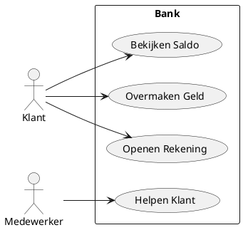

---
title:
  - 1. Uitleg use case diagrammen
taxonomie:
  - rs-10.2.Use-Case-Diagram.OI
  - rs-10.3.Use-Case-Diagram.OI
---

-=PRESENTATIE=-

## Wat is een use case diagram?
Een **use case diagram** is een grafische weergave van de interacties tussen actoren en een systeem, waarbij de functionaliteit van het systeem wordt beschreven vanuit het perspectief van de gebruiker. Het helpt om de vereisten en doelen van een systeem te identificeren en te visualiseren.

> [!TIP] Casus
> Stel je ontwikkelt een bankapplicatie. Een **use case diagram** kan worden gebruikt om te tonen hoe klanten het systeem gebruiken om hun saldo te bekijken, geld over te maken, en een rekening kunnen openen.

## Hoe zit een use case diagram in elkaar?
Een **use case diagram** bestaat uit één of meerdere actoren, use cases en relaties. **Actoren** kunnen externe entiteiten zijn, zoals gebruikers of andere systemen. **Use cases** beschrijven de acties die het systeem uitvoert voor een actor. Relaties tussen actoren en use cases worden vaak aangeduid met pijlen.

### Voorbeeld



## Hoe gebruik je een use case diagram?
**Use case diagrammen** worden gebruikt in de vroege fasen van het softwareontwikkelingsproces om de interacties met het systeem te begrijpen. Ze zijn vooral handig voor het communiceren van systeemfunctionaliteit aan belanghebbenden die geen technische achtergrond hebben.

Een **use case diagram** biedt een overzicht van het systeem vanuit het perspectief van de gebruiker en helpt om te bepalen welke functionaliteiten prioriteit hebben. Dit diagram wordt vaak gebruikt als basis voor de ontwikkeling van meer gedetailleerde specificaties en voor het ontwerpen van de systeemarchitectuur.

> [!TIP] Casus
> Stel je werkt aan een e-commerce website. Door een use-case-diagram te maken, kun je de verschillende acties van klanten en beheerders, zoals het toevoegen van producten aan een winkelwagentje, het afrekenen, en het beheren van de voorraad, duidelijk in kaart brengen.
>
> **Mogelijke uitwerking van de casus**
> ```plantuml
> @startuml
> left to right direction
> 
> actor Klant as k
> actor Systeem as M
> actor Beheerder as B
> 
> rectangle "E-commerce website" {
> 	usecase "Zoeken producten" as UC1
> 	usecase "Toevoegen aan winkelwagen" as UC2
> 	usecase "Afrekenen" as UC3
> 	usecase "Verwerken bestelling" as UC4
> 	usecase "Beheren Voorraad" as UC5
> }
> 
> k --> UC1
> k --> UC2
> k --> UC3
> M --> UC3
> M --> UC4
> B --> UC4
> B --> UC5
> @enduml

